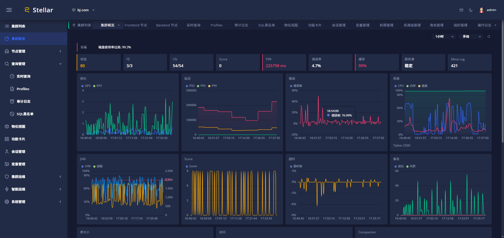
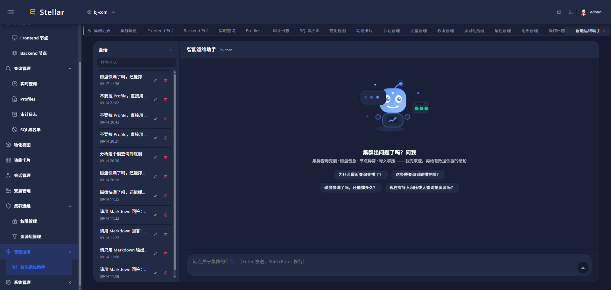
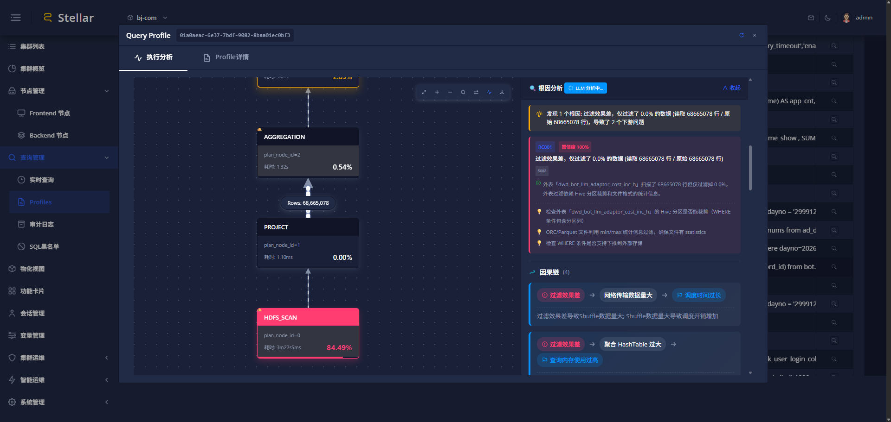
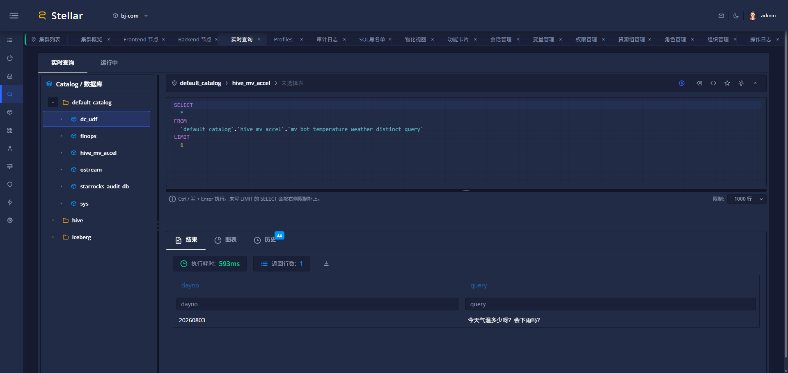
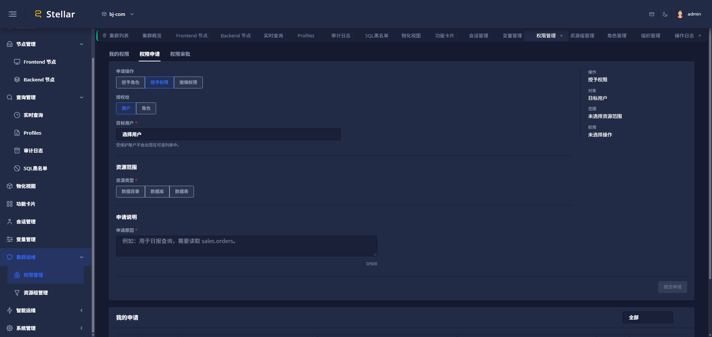

# Stellar

> 面向 StarRocks 与 Apache Doris 的 OLAP 集群运维平台。

Stellar 将集群、节点、查询、权限和审计集中到一个控制台，并提供 Query Profile 诊断、容量预测、告警通知和有人工确认的智能运维操作。

[快速体验](#快速体验) · [部署指南](docs/deploy/DEPLOYMENT_GUIDE.md) · [版本发布](https://github.com/jlon/stellar/releases) · [配置与运维](docs/deploy/DEPLOYMENT_GUIDE.md#配置说明) · [许可证](LICENSE)

<p align="center">
  
</p>

## 能做什么

| 能力 | 说明 |
| --- | --- |
| 多集群运维 | 统一管理 StarRocks 与 Doris 集群，查看 FE、BE/CN 节点状态、资源指标和容量趋势。 |
| 查询诊断 | 提供实时查询、SQL 工作台、审计日志与 Query Profile 可视化，定位执行瓶颈并给出诊断建议。 |
| 受控智能运维 | 基于真实集群数据完成取证、诊断和容量预测；执行动作需要人工确认，并保留审计记录。 |
| 安全与治理 | 支持组织、用户、角色、资源组、权限申请和操作审计，适用于多团队协作。 |

## 界面预览

<table>
  <tr>
    <td width="50%"><br><b>智能运维助手</b><br>基于集群证据回答问题，生成可审计的建议与受控操作。</td>
    <td width="50%"><br><b>Query Profile 诊断</b><br>在执行 DAG 中定位瓶颈，并展示根因链路和优化建议。</td>
  </tr>
  <tr>
    <td width="50%"><br><b>SQL 工作台</b><br>浏览 Catalog，执行 SQL，查看结果、图表与历史记录。</td>
    <td width="50%"><br><b>权限与审计</b><br>按组织和角色管理访问范围，记录关键操作。</td>
  </tr>
</table>

## 快速体验

最简单的方式是启动 Docker 镜像。首次启动会为 `admin` 生成一次性密码，登录后请立即修改。

```bash
docker run -d \
  --name stellar \
  --restart unless-stopped \
  -p 9527:9527 \
  -v "$(pwd)/stellar-data:/data" \
  ghcr.io/jlon/stellar:latest

docker logs stellar 2>&1 | grep 'password:'
```

打开 `http://localhost:9527`，使用 `admin` 和日志中的一次性密码登录。

生产部署、DEB 包、静态二进制、Docker Compose、Kubernetes、数据目录和升级方式见[部署指南](docs/deploy/DEPLOYMENT_GUIDE.md)。

## 从源码开发

环境要求：Rust 1.75+、Node.js 与 npm、Docker（仅 Docker 开发时需要）。

```bash
git clone https://github.com/jlon/stellar.git
cd stellar

# 终端一：后端开发服务
make dev-backend

# 终端二：前端开发服务
make dev-frontend
```

`make dev-backend` 会显式设置 `STELLAR_ENV=development`：新建本地数据目录使用
`admin/admin`，历史 `admin/admin` 种子保持可用；已初始化账户不会在重启时自动改密。
开发后端默认只监听 `127.0.0.1:8081`。前端开发地址为 `http://localhost:4200`。
发布静态二进制及 DEB/npm 包使用：

```bash
make build
```

完整发布流程见 [发布流程](docs/RELEASE_PROCESS.md)；可用命令见 [Makefile](Makefile)。

## 添加集群前的准备

请为被管理的 StarRocks 或 Doris 集群创建最小权限的监控账号，不要使用 `root`。StarRocks 可直接执行仓库提供的初始化脚本：

```bash
mysql -h <fe_host> -P 9030 -u root -p \
  < scripts/permissions/setup_stellar_role.sql
```

详细权限范围和验证方式见 [权限脚本说明](scripts/permissions/README_PERMISSIONS.md)。

## 技术栈

- 后端：Rust、Axum、SQLx；平台元数据可使用 SQLite、MySQL/MariaDB 或 PostgreSQL。
- 前端：Angular、Nebular、ECharts。
- 发布：musl 全静态二进制、Docker、Kubernetes 与 Debian 包。

## 文档与参与

- [部署指南](docs/deploy/DEPLOYMENT_GUIDE.md)
- [Query Profile 诊断设计](docs/profile/profile-diagnostic-system-review.md)
- [智能运维设计](docs/agent/ops-agent-design.md)
- [更新记录](CHANGELOG.md)
- [提交 Pull Request](https://github.com/jlon/stellar/pulls)

提交问题或改进建议请使用 [GitHub Issues](https://github.com/jlon/stellar/issues)。提交代码前，请运行对应模块的测试与 lint。

## License

Stellar 使用 [Apache License 2.0](LICENSE) 发布。

---

<sub>English: Stellar is an operations control plane for StarRocks and Apache Doris. It unifies cluster observability, query diagnostics, governance, and human-approved AI-assisted operations.</sub>
