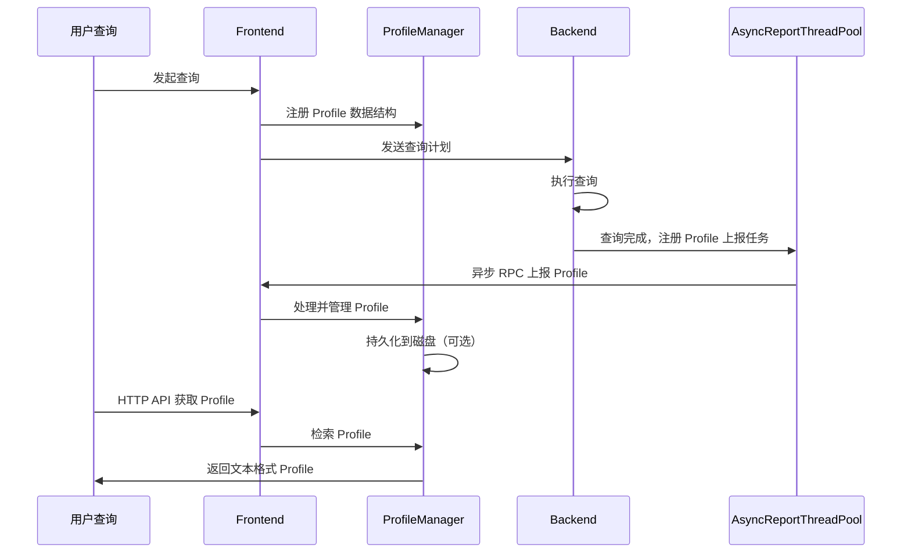

# Doris Query Profile 生成机制深度解析

## 概述

本文档基于 Apache Doris 4.x 源码和官方文档，深入分析 Query Profile 的生成机制、数据结构、文本格式生成过程，为 Stellar 平台的 Profile 解析器适配提供技术参考。

## 1. Profile 整体架构

### 1.1 核心组件

Doris Query Profile 的核心由两部分组成：

- **FE 的 ProfileManager**: 负责 Profile 的收集、存储、管理和检索
- **BE 的 AsyncReportThreadPool**: 负责异步上报 Profile 数据从 BE 到 FE

### 1.2 数据流转流程



## 2. Profile 数据结构

### 2.1 Profile 类结构

根据 `Profile.java` 源码，Profile 类的核心结构如下：

```java
public class Profile {
    // SummaryProfile: 包含查询的元信息（Profile ID、开始时间、结束时间等）
    private SummaryProfile summaryProfile;
    
    // ExecutionProfile 列表: 每个 ExecutionProfile 代表一次完整的查询执行
    // 一个 Job 可能包含多个查询（如 Broker Load），因此有多个 ExecutionProfile
    List<ExecutionProfile> executionProfiles;
    
    // Profile 存储路径（持久化后）
    private String profileStoragePath;
    
    // 查询是否完成（Coordinator 或 StmtExecutor 完成）
    boolean isQueryFinished;
    
    // 查询完成时间戳
    private long queryFinishTimestamp;
    
    // PlanNode 映射
    private Map<Integer, String> planNodeMap;
    
    // Profile 级别（1=精简版 MergedProfile, 2=详细版, 3=最详细版）
    private int profileLevel;
}
```

### 2.2 SummaryProfile 结构

`SummaryProfile` 包含查询的元信息，用于检索和展示：

```java
public class SummaryProfile {
    // 关键字段（通过 getAsInfoStings() 返回）:
    // - Profile ID: 查询的唯一标识
    // - Task Type: QUERY 或 LOAD
    // - Start Time: 查询开始时间
    // - End Time: 查询结束时间
    // - Total: 总耗时
    // - Task State: 查询状态（OK, EOF, TIMEOUT 等）
    // - User: 执行用户
    // - Default Catalog: 默认 Catalog
    // - Default Db: 默认数据库
    // - Sql Statement: SQL 语句
    // - Doris Version: Doris 版本号
    // - Trace ID: 追踪 ID（可选）
    
    // 字段顺序（SUMMARY_KEYS）:
    public static final List<String> SUMMARY_KEYS = Arrays.asList(
        "Profile ID",
        "Task Type", 
        "Start Time",
        "End Time",
        "Total",
        "Task State",
        "User",
        "Default Catalog",
        "Default Db",
        "Sql Statement"
    );
}
```

### 2.3 ExecutionProfile 结构

`ExecutionProfile` 包含查询执行的详细信息：

```java
public class ExecutionProfile {
    // 每个 ExecutionProfile 包含多个 Fragment
    // Fragment 是查询计划的基本执行单元
    // Fragment 内部包含 Pipeline，Pipeline 包含 Operator
}
```

## 3. Profile 文本格式生成

### 3.1 Profile 文本结构

根据官方文档和实际 Profile 文件，Doris Profile 文本格式如下：

```
Summary:
  - Profile ID: <query_id>
  - Task Type: QUERY
  - Start Time: <start_time>
  - End Time: <end_time>
  - Total: <total_time>
  - Task State: <state>
  - User: <user>
  - Default Catalog: <catalog>
  - Default Db: <db>
  - Sql Statement: <sql>

Execution Summary:
  - Parse SQL Time: <time>
  - Analysis Time: <time>
  - Plan Time: <time>
  - Schedule Time: <time>
  - Fragment RPC Phase1 Time: <time>
  - Fragment RPC Phase2 Time: <time>
  - Wait and Fetch Result Time: <time>
  - Doris Version: <version>
  - Is Nereids: Yes/No
  - Total Instances Num: <num>
  - Parallel Fragment Exec Instance Num: <num>
  - ... (更多执行统计信息)

ChangedSessionVariables:
  VarName | CurrentValue | DefaultValue
  ------------------------------|--------------|-------------
  <var1> | <value1> | <default1>
  <var2> | <value2> | <default2>
  ...

MergedProfile 
     Fragments:
       Fragment 0:
         Pipeline : 0(instance_num=1):
           RESULT_SINK_OPERATOR (id=0):
              - CloseTime: avg 1.832us, max 1.832us, min 1.832us
              - ExecTime: avg 451.10us, max 451.10us, min 451.10us
              - InputRows: sum 2, avg 2, max 2, min 2
              - MemoryUsage: sum 0.00 , avg 0.00 , max 0.00 , min 0.00 
              ...
           EXCHANGE_OPERATOR (id=2):
              - BlocksProduced: sum 2, avg 2, max 2, min 2
              - ExecTime: avg 36.237us, max 36.237us, min 36.237us
              ...
       Fragment 1:
         Pipeline : 0(instance_num=14):
           DATA_STREAM_SINK_OPERATOR (id=2,dst_id=2):
              ...
           LOCAL_EXCHANGE_OPERATOR (LOCAL_MERGE_SORT) (id=-3):
              ...
       ...

DetailProfile:
  Execution Profile <query_id>:
    Fragment 0:
      Pipeline 0(instance_num=1):
        Instance <instance_id>:
          RESULT_SINK_OPERATOR (id=0):
            - CloseTime: 1.832us
            - ExecTime: 451.10us
            ...
      ...
    ...
```

### 3.2 文本生成方法

根据 `Profile.java` 源码分析，Profile 文本通过以下方法生成：

1. **`getProfileByLevel()`**: 根据 `profileLevel` 生成不同详细程度的 Profile 文本
   - Level 1: 仅包含 MergedProfile（精简版）
   - Level 2: 包含 MergedProfile + 详细 Counter
   - Level 3: 包含 MergedProfile + 最详细 Counter（可能影响性能）

2. **`getProfileBrief()`**: 生成 Profile 的简要信息（仅 Summary）

3. **文本生成流程**:
   ```
   Profile.getProfileByLevel()
   ├── SummaryProfile.toString() -> "Summary: ..."
   ├── ExecutionSummary.toString() -> "Execution Summary: ..."
   ├── ChangedSessionVariables.toString() -> "ChangedSessionVariables: ..."
   ├── MergedProfile.toString() -> "MergedProfile \n Fragments: ..."
   └── DetailProfile.toString() -> "DetailProfile: Execution Profile ..."
   ```

### 3.3 MergedProfile 生成逻辑

MergedProfile 是多个 BE 上报的 Profile 数据的聚合结果：

1. **Fragment 聚合**: 将来自不同 BE 的相同 Fragment 的统计数据聚合
   - 相同 Operator 的 Counter 进行 sum/avg/max/min 聚合
   - Pipeline 的 `instance_num` 表示该 Pipeline 在所有 BE 上的 PipelineTask 数量之和

2. **格式特点**:
   - `MergedProfile ` (注意：后面有空格和换行)
   - `Fragments:` 标记 Fragment 列表的开始
   - `Fragment X:` 标记每个 Fragment
   - `Pipeline : X(instance_num=Y):` 或 `Pipeline X(instance_num=Y):` 标记 Pipeline
   - `OPERATOR_NAME (id=X):` 或 `OPERATOR_NAME(id=X):` 标记 Operator

### 3.4 Operator Counter 格式

每个 Operator 包含两类 Counter：

1. **CommonCounters** (所有 Operator 共有):
   ```
   CommonCounters:
     - ExecTime: avg <time>, max <time>, min <time>
     - InputRows: sum <num>, avg <num>, max <num>, min <num>  (SinkOperator)
     - RowsProduced: sum <num>, avg <num>, max <num>, min <num>  (非SinkOperator)
     - MemoryUsage: sum <size>, avg <size>, max <size>, min <size>
     - MemoryUsagePeak: sum <size>, avg <size>, max <size>, min <size>
     - WaitForDependencyTime: avg <time>, max <time>, min <time>
   ```

2. **CustomCounters** (Operator 特有):
   ```
   CustomCounters:
     - <counter_name>: <value>
     - <counter_name>: sum <value>, avg <value>, max <value>, min <value>
   ```

## 4. Profile 收集流程

### 4.1 FE 侧流程

1. **查询开始前**: `StmtExecutor` 或 `Coordinator` 创建 `Profile` 对象并注册到 `ProfileManager`
2. **查询执行中**: `Profile` 对象更新执行统计信息
3. **查询完成后**: `ProfileManager` 等待 BE 异步上报（最多等待 `profile_async_collect_expire_time_secs` 秒）
4. **持久化**: 满足条件的 Profile 被持久化到磁盘（`spilled_profile_storage_path`）

### 4.2 BE 侧流程

1. **查询执行**: BE 执行查询，收集运行时统计信息到 `RuntimeProfile`
2. **查询完成**: 查询完成后，将 `RuntimeProfile` 注册到 `AsyncReportThreadPool`
3. **异步上报**: `AsyncReportThreadPool` 以查询为粒度发起 RPC，将 Profile 数据发送到 FE
4. **FE 聚合**: FE 接收多个 BE 的 Profile，聚合生成 MergedProfile

### 4.3 ProfileManager 关键方法

- **`pushProfile(Profile profile)`**: 将 Profile 添加到内存管理
- **`getProfile(String id)`**: 获取指定 query_id 的 Profile 文本
- **`getAllQueries()`**: 获取所有 Profile 的摘要信息（用于 `SHOW QUERY PROFILE`）
- **`writeProfileToStorage()`**: 将 Profile 持久化到磁盘
- **`loadProfilesFromStorageIfFirstTime()`**: 从磁盘加载 Profile 到内存

## 5. Profile 存储格式

### 5.1 文件命名

Profile 文件命名格式：`<timestamp>_<query_id>.zip`

- `timestamp`: 查询完成时间戳（毫秒）
- `query_id`: 查询 ID（TUniqueId 格式：`high_low`）

### 5.2 文件内容

Profile 文件是一个 ZIP 压缩文件，包含：

1. **SummaryProfile**: JSON 格式的元信息
2. **ExecutionProfile**: 文本格式的执行详情

### 5.3 存储路径

- 默认路径: `log/profile/`
- 可通过 `fe.conf` 的 `spilled_profile_storage_path` 配置

## 6. HTTP API 接口

### 6.1 获取 Profile 列表

**SQL 命令**: `SHOW QUERY PROFILE`

**实现**: `ProfileManager.getAllQueries()` 返回 `SummaryProfile.SUMMARY_KEYS` 对应的列数据

**返回列顺序**:
1. Profile ID
2. Task Type
3. Start Time
4. End Time
5. Total
6. Task State
7. User
8. Default Catalog
9. Default Db
10. Sql Statement

### 6.2 获取 Profile 详情

**HTTP API**: `GET /api/profile/text?query_id=<query_id>`

**实现**: `ProfileAction.profileText()` -> `ProfileManager.getProfile()` -> `Profile.getProfileByLevel()`

**返回**: 纯文本格式的 Profile

## 7. Profile Level 详解

### 7.1 Level 1 (默认)

- 仅包含 MergedProfile
- Counter 为精简版（仅包含关键 Counter）
- 适合快速定位性能瓶颈

### 7.2 Level 2

- 包含 MergedProfile + 详细 Counter
- 例如 `EXCHANGE_OPERATOR` 会显示更多 Counter：
  - `CreateMergerTime`
  - `DataArrivalWaitTime`
  - `DecompressBytes`
  - `DecompressTime`
  - `DeserializeRowBatchTimer`
  - `FilterTime`
  - `GetDataFromRecvrTime`
  - `LocalBytesReceived`
  - `RemoteBytesReceived`
  - 等等

### 7.3 Level 3

- 包含 MergedProfile + 最详细 Counter
- 部分 Counter 的采集可能影响查询性能
- 仅在深度分析时使用

## 8. 关键数据结构映射

### 8.1 Query Plan 层级结构

```
Query
├── Fragment 0
│   ├── PlanNode 0 (RESULT_SINK)
│   └── PlanNode 2 (EXCHANGE)
├── Fragment 1
│   ├── PlanNode 2 (DATA_STREAM_SINK)
│   ├── PlanNode 7 (SORT)
│   └── PlanNode 6 (AGGREGATION)
└── ...
```

### 8.2 Execution 层级结构

```
ExecutionProfile
├── Fragment 0
│   └── Pipeline 0(instance_num=1)
│       ├── RESULT_SINK_OPERATOR (id=0)
│       └── EXCHANGE_OPERATOR (id=2)
├── Fragment 1
│   ├── Pipeline 0(instance_num=2)
│   │   ├── DATA_STREAM_SINK_OPERATOR (id=2)
│   │   └── LOCAL_EXCHANGE_OPERATOR (id=-3)
│   ├── Pipeline 1(instance_num=2)
│   │   ├── SORT_SINK_OPERATOR (id=7)
│   │   └── AGGREGATION_OPERATOR (id=6)
│   └── Pipeline 2(instance_num=2)
│       ├── AGGREGATION_SINK_OPERATOR (id=6)
│       └── EXCHANGE_OPERATOR (id=5)
└── ...
```

### 8.3 PlanNode 到 Operator 的转换

- **DATA_STREAM_SINK** → `DATA_STREAM_SINK_OPERATOR` (dest_id=目标 PlanNode ID)
- **EXCHANGE** → `EXCHANGE_OPERATOR` (id=PlanNode ID)
- **HASH_JOIN** → `HASH_JOIN_SINK_OPERATOR` + `HASH_JOIN_OPERATOR` (id=PlanNode ID)
- **AGGREGATION** → `AGGREGATION_SINK_OPERATOR` + `AGGREGATION_OPERATOR` (id=PlanNode ID)
- **SORT** → `SORT_SINK_OPERATOR` + `SORT_OPERATOR` (id=PlanNode ID)
- **OLAP_SCAN** → `OLAP_SCAN_OPERATOR` (id=PlanNode ID)
- **RESULT_SINK** → `RESULT_SINK_OPERATOR` (id=PlanNode ID，通常为 0)

## 9. 解析要点总结

### 9.1 格式识别

- **Doris Profile**: 以 `Summary:` 开头
- **StarRocks Profile**: 以 `Query:` 开头

### 9.2 MergedProfile 提取

- 查找 `MergedProfile ` (注意空格) 或 `MergedProfile:` 或 `MergedProfile\n`
- 提取到 `DetailProfile:` 或 `Execution Profile` 之前的内容
- 内部包含 `Fragments:` 标记

### 9.3 Fragment 解析

- Fragment 格式: `Fragment X:`
- Pipeline 格式: `Pipeline : X(instance_num=Y):` 或 `Pipeline X(instance_num=Y):`
- Operator 格式: `OPERATOR_NAME (id=X):` 或 `OPERATOR_NAME(id=X):` 或 `OPERATOR_NAME (id=X. nereids_id=Y):`

### 9.4 Operator ID 提取

- StarRocks: `plan_node_id=X`
- Doris: `id=X` (可能包含 `nereids_id=Y`)

### 9.5 Counter 解析

- CommonCounters 和 CustomCounters 都有明确的标记
- Counter 值格式: `sum <value>, avg <value>, max <value>, min <value>` 或单个值

## 10. 参考源码文件

- `fe/fe-core/src/main/java/org/apache/doris/common/profile/ProfileManager.java`: Profile 管理器
- `fe/fe-core/src/main/java/org/apache/doris/common/profile/Profile.java`: Profile 主类
- `fe/fe-core/src/main/java/org/apache/doris/common/profile/SummaryProfile.java`: Summary 结构
- `fe/fe-core/src/main/java/org/apache/doris/common/profile/ExecutionProfile.java`: Execution Profile 结构
- `fe/fe-core/src/main/java/org/apache/doris/httpv2/rest/ProfileAction.java`: HTTP API 实现
- `be/src/runtime/runtime_profile.h`: BE 端 RuntimeProfile 定义（C++）

## 11. 配置参数

### 11.1 FE 配置 (`fe.conf`)

- `enable_profile`: 是否启用 Profile（默认 false）
- `profile_level`: Profile 级别（默认 1）
- `auto_profile_threshold_ms`: 自动 Profile 阈值（默认 -1，表示所有查询）
- `max_query_profile_num`: 内存中最多保留的 Profile 数量（默认 500）
- `max_spilled_profile_num`: 磁盘上最多保存的 Profile 数量（默认 500）
- `spilled_profile_storage_path`: Profile 存储路径（默认 `log/profile/`）
- `spilled_profile_storage_limit_bytes`: Profile 存储空间限制（默认 1GB）
- `profile_async_collect_expire_time_secs`: Profile 异步收集超时时间（默认 5 秒）

## 12. 总结

Doris Query Profile 的生成机制涉及 FE 和 BE 的协同工作：

1. **FE**: 管理 Profile 生命周期，聚合多个 BE 的数据，生成 MergedProfile
2. **BE**: 收集运行时统计信息，异步上报到 FE
3. **文本格式**: 通过 `Profile.getProfileByLevel()` 生成，包含 Summary、Execution Summary、ChangedSessionVariables、MergedProfile、DetailProfile 等部分
4. **存储**: Profile 以 ZIP 格式持久化到磁盘，包含 JSON 格式的 SummaryProfile 和文本格式的 ExecutionProfile

理解这些机制有助于：
- 正确解析 Doris Profile 文本格式
- 提取 Fragment、Pipeline、Operator 层级结构
- 构建执行树（DAG）
- 适配 Stellar 平台的 Profile 解析器

