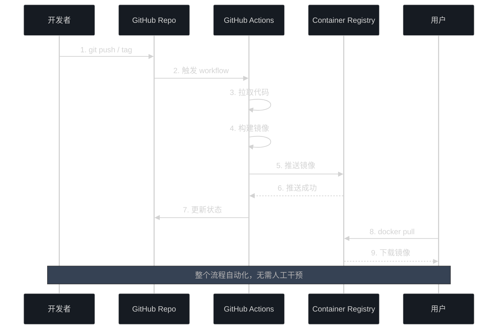

# GitHub Container Registry 配置清单

## ✅ 配置完成项

### 1. 已创建文件

- [x] `.github/workflows/docker-publish.yml` - GitHub Actions 工作流配置
- [x] `docs/GHCR_GUIDE.md` - 详细使用指南
- [x] `docs/GHCR_CHECKLIST.md` - 本清单文件

### 2. 已配置功能

- [x] 自动构建 Docker 镜像
- [x] 自动推送到 ghcr.io
- [x] 版本标签自动管理
- [x] 构建缓存优化
- [x] 多触发方式支持
- [x] 构建摘要生成

## 📋 使用前检查

### 第一次推送前

1. **确认仓库设置**
   ```bash
   # 检查远程仓库地址
   git remote -v
   # 应该显示: https://github.com/jlon/stellar.git
   ```

2. **确认文件已提交**
   ```bash
   # 查看新增的文件
   git status
   
   # 如果有未提交的文件
   git add .github/workflows/docker-publish.yml
   git add docs/GHCR_GUIDE.md
   git add docs/GHCR_CHECKLIST.md
   ```

3. **推送到 GitHub**
   ```bash
   # 推送到主分支
   git push origin main
   ```

### 第一次构建测试

#### 选项 1: 手动触发（推荐用于测试）

1. 访问 `https://github.com/jlon/stellar/actions`
2. 选择 "Docker Image CI/CD" workflow
3. 点击 "Run workflow" 按钮
4. 等待构建完成（大约 5-10 分钟）

#### 选项 2: 打版本标签

```bash
# 创建并推送测试标签
git tag v0.1.0-test
git push origin v0.1.0-test

# 查看构建状态
# 访问 https://github.com/jlon/stellar/actions
```

## 🔍 验证配置

### 1. 检查 workflow 文件

```bash
# 确认文件存在
ls -la .github/workflows/docker-publish.yml

# 查看文件内容
cat .github/workflows/docker-publish.yml
```

### 2. 检查 Dockerfile 路径

```bash
# 确认 Dockerfile 存在于正确位置
ls -la deploy/docker/Dockerfile
```

### 3. 构建成功后验证

```bash
# 拉取镜像
docker pull ghcr.io/jlon/stellar:latest

# 查看镜像信息
docker images | grep stellar

# 测试运行
docker run --rm ghcr.io/jlon/stellar:latest ./bin/stellar --version
```

## 📊 构建流程图



## ❓ 常见问题排查

### 问题 1: workflow 没有触发

**症状**: 推送代码后没有看到 Actions 运行

**排查步骤**:
```bash
# 1. 确认 workflow 文件已推送
git log --oneline --all | grep -i "github actions"

# 2. 检查文件路径是否正确
ls .github/workflows/

# 3. 访问 Actions 页面查看是否有错误
# https://github.com/jlon/stellar/actions
```

### 问题 2: 构建失败

**症状**: Actions 运行但构建失败

**排查步骤**:
1. 查看 Actions 日志中的详细错误
2. 常见错误:
   - Dockerfile 路径错误 → 检查 `file: ./deploy/docker/Dockerfile`
   - 权限不足 → 检查仓库的 Actions 权限设置
   - 构建超时 → 优化 Dockerfile，减少构建时间

### 问题 3: 无法推送到 GHCR

**症状**: 构建成功但推送失败

**排查步骤**:
1. 检查仓库设置:
   - 访问 `Settings > Actions > General`
   - 确认 "Workflow permissions" 设置为 "Read and write permissions"
2. 检查包权限:
   - 访问 `Settings > Actions > General > Workflow permissions`
   - 确认勾选了 "Allow GitHub Actions to create and approve pull requests"

### 问题 4: 镜像拉取失败

**症状**: `docker pull` 失败

**排查步骤**:
```bash
# 1. 检查镜像是否存在
# 访问 https://github.com/jlon/stellar/pkgs/container/stellar

# 2. 如果是私有镜像，需要登录
echo $GITHUB_TOKEN | docker login ghcr.io -u USERNAME --password-stdin

# 3. 使用完整的镜像名
docker pull ghcr.io/jlon/stellar:latest
```

## 🎯 下一步行动

### 立即执行

- [ ] 提交并推送配置文件到 GitHub
- [ ] 触发第一次构建测试
- [ ] 验证镜像可以正常拉取

### 可选优化

- [ ] 启用多架构构建（AMD64 + ARM64）
- [ ] 配置构建状态徽章
- [ ] 设置自动化测试
- [ ] 添加镜像扫描（安全检查）

### README 更新建议

在 `README.md` 中添加以下内容：

```markdown
## Docker 快速部署

### 方式 1: 使用 GitHub Container Registry（推荐）

\`\`\`bash
# 拉取最新镜像
docker pull ghcr.io/jlon/stellar:latest

# 运行容器
docker run -d -p 8080:8080 --name stellar \
  -v $(pwd)/data:/app/data \
  -v $(pwd)/logs:/app/logs \
  ghcr.io/jlon/stellar:latest

# 访问应用
open http://localhost:8080
\`\`\`

### 版本说明

- \`latest\` - 最新稳定版本（自动构建自 main 分支）
- \`v1.0.0\` - 特定版本
- \`main\` - 开发版本

查看所有可用版本: https://github.com/jlon/stellar/pkgs/container/stellar
```

## 📈 性能优化建议

### 1. 优化 Dockerfile

- [x] 使用多阶段构建（已实现）
- [ ] 添加 `.dockerignore` 文件
- [ ] 优化层顺序，将不常变的层放前面

### 2. 优化构建时间

- [x] 启用构建缓存（已配置）
- [ ] 使用自托管 Runner（可选）
- [ ] 并行构建多个架构（可选）

### 3. 镜像大小优化

当前 Dockerfile 已经:
- [x] 使用 `debian:bookworm-slim` 基础镜像
- [x] 清理不必要的依赖
- [ ] 可以考虑使用 `alpine` 进一步减小（需要测试兼容性）

## 📝 Git 提交建议

根据项目的 `.gitmessage` 格式:

```bash
# 提交消息
git commit -m "feat: 添加 GitHub Container Registry 自动构建配置

- 新增 GitHub Actions workflow 用于自动构建 Docker 镜像
- 配置自动推送到 ghcr.io
- 支持版本标签、分支和手动触发
- 添加完整的使用指南和检查清单

Related: #<issue-number>
"
```

## ✨ 完成标志

当你看到以下内容时，说明配置成功:

1. ✅ GitHub Actions 页面显示绿色的构建状态
2. ✅ Packages 页面出现 `stellar` 容器
3. ✅ 可以成功 `docker pull` 镜像
4. ✅ 容器可以正常运行

---

**配置完成！现在你可以享受自动化的 Docker 镜像构建和发布了！** 🎉
