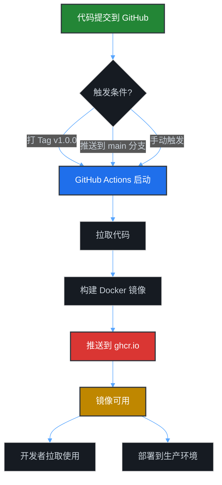
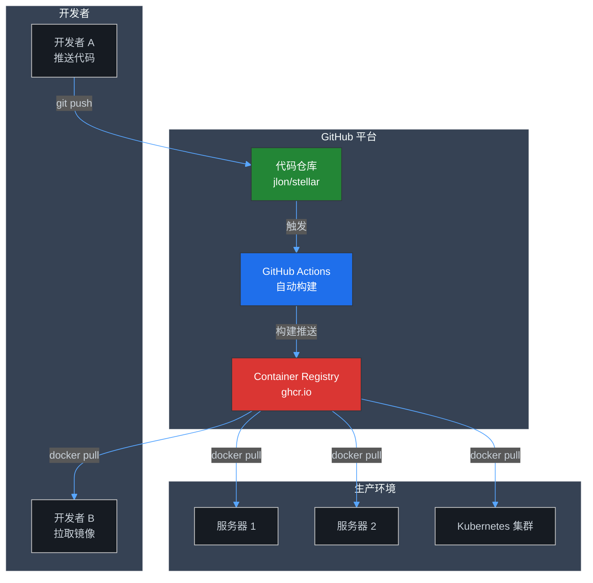

# GitHub Container Registry (GHCR) 使用指南

## 什么是 GitHub Container Registry?

GitHub Container Registry (ghcr.io) 是 GitHub 提供的容器镜像托管服务，相当于你自己的 Docker Hub。

### 核心优势

- ✅ **完全免费** - 公开镜像无限存储和流量
- ✅ **无缝集成** - 代码和镜像在同一个仓库管理
- ✅ **自动构建** - 代码提交后自动构建并推送镜像
- ✅ **权限管理** - 细粒度的访问控制
- ✅ **多架构支持** - 支持 AMD64/ARM64 等多平台

## 工作流程



## 快速开始

### 1. 首次使用（已自动配置）

项目已经配置好了 `.github/workflows/docker-publish.yml`，无需额外操作。

### 2. 触发构建

有三种方式触发自动构建：

#### 方式 1: 打版本标签（推荐）

```bash
# 创建并推送版本标签
git tag v1.0.0
git push origin v1.0.0

# 自动生成的镜像标签:
# - ghcr.io/jlon/stellar:v1.0.0
# - ghcr.io/jlon/stellar:1.0
# - ghcr.io/jlon/stellar:1
# - ghcr.io/jlon/stellar:latest
```

#### 方式 2: 推送到 main 分支

```bash
git push origin main

# 自动生成的镜像标签:
# - ghcr.io/jlon/stellar:main
# - ghcr.io/jlon/stellar:main-<commit-sha>
```

#### 方式 3: 手动触发

1. 打开 GitHub 仓库页面
2. 点击 **Actions** 标签
3. 选择 **Docker Image CI/CD** workflow
4. 点击 **Run workflow** 按钮

### 3. 查看构建状态

1. 打开仓库的 **Actions** 标签
2. 查看最新的 workflow 运行记录
3. 点击查看详细日志和构建摘要

### 4. 使用镜像

#### 拉取镜像

```bash
# 拉取最新版本
docker pull ghcr.io/jlon/stellar:latest

# 拉取特定版本
docker pull ghcr.io/jlon/stellar:v1.0.0

# 如果是私有镜像，需要先登录
echo $GITHUB_TOKEN | docker login ghcr.io -u USERNAME --password-stdin
```

#### 运行容器

```bash
docker run -d \
  --name stellar \
  -p 8080:8080 \
  -v $(pwd)/data:/app/data \
  -v $(pwd)/logs:/app/logs \
  ghcr.io/jlon/stellar:latest
```

## 镜像标签说明

### 自动生成的标签

| 触发方式 | 生成的标签 | 示例 |
|---------|-----------|------|
| 推送 `v1.2.3` 标签 | `v1.2.3`, `1.2`, `1`, `latest` | `ghcr.io/jlon/stellar:v1.2.3` |
| 推送到 `main` 分支 | `main`, `main-<sha>` | `ghcr.io/jlon/stellar:main` |
| Pull Request | `pr-<number>` | `ghcr.io/jlon/stellar:pr-42` |

### 推荐的标签使用策略

- **生产环境**: 使用具体版本号 `v1.2.3`
- **测试环境**: 使用 `main` 或分支名
- **开发环境**: 使用 `latest` 或特定分支

## 高级配置

### 1. 多架构构建（可选）

如果需要支持 ARM 架构（如 Apple M1/M2），可以修改 workflow:

```yaml
# In .github/workflows/docker-publish.yml
- name: Build and push Docker image
  uses: docker/build-push-action@v5
  with:
    platforms: linux/amd64,linux/arm64  # 添加这行
    # ... other options
```

### 2. 构建优化

已启用的优化:
- ✅ GitHub Actions 缓存 (加速重复构建)
- ✅ Docker BuildKit
- ✅ 多层缓存策略

### 3. 镜像可见性设置

默认情况下，镜像的可见性继承自仓库:
- 公开仓库 → 公开镜像
- 私有仓库 → 私有镜像

修改镜像可见性:
1. 访问 `https://github.com/jlon/stellar/pkgs/container/stellar`
2. 点击 **Package settings**
3. 修改 **Danger Zone** 中的可见性设置

## 常见问题

### Q1: 构建失败怎么办?

1. 检查 Actions 日志中的错误信息
2. 常见原因:
   - Dockerfile 路径错误
   - 构建依赖缺失
   - 构建超时（免费版有时间限制）

### Q2: 如何删除旧镜像?

1. 访问 `https://github.com/jlon/stellar/pkgs/container/stellar`
2. 选择要删除的版本
3. 点击 **Delete** 按钮

### Q3: 如何给其他人镜像访问权限?

对于私有镜像:
1. 访问包设置页面
2. 点击 **Manage access**
3. 添加用户或团队

### Q4: 构建太慢怎么办?

优化建议:
1. 使用 `.dockerignore` 排除不必要的文件
2. 优化 Dockerfile 层顺序（不常变的层放前面）
3. 使用构建缓存
4. 考虑使用自托管 runner

## 与 Docker Hub 对比

| 特性 | GitHub Container Registry | Docker Hub |
|------|--------------------------|------------|
| 公开镜像存储 | ✅ 无限 | ✅ 无限 |
| 私有镜像 | ✅ 免费（有限额度） | ⚠️ 收费 |
| 与代码集成 | ✅ 原生集成 | ❌ 需要配置 |
| 构建速度 | ✅ 快（在同一网络） | ⚠️ 一般 |
| 访问速度（国内） | ⚠️ 需要代理 | ⚠️ 需要代理 |

## 更新 README

建议更新 README.md 中的 Docker 部署说明:

```bash
# 使用 GitHub Container Registry 镜像（推荐）
docker pull ghcr.io/jlon/stellar:latest
docker run -d -p 8080:8080 --name stellar \
  -v $(pwd)/data:/app/data \
  -v $(pwd)/logs:/app/logs \
  ghcr.io/jlon/stellar:latest

# 或者使用 Docker Hub 镜像
docker pull docker.io/johndockerhub/stellar:latest
```

## 监控和统计

查看镜像使用统计:
1. 访问 `https://github.com/jlon/stellar/pkgs/container/stellar`
2. 查看 **Insights** 标签
3. 可以看到:
   - 拉取次数
   - 下载量
   - 版本分布

## 架构图



## 下一步

1. ✅ 配置已完成
2. 📝 推送代码到 GitHub 测试构建
3. 🚀 打版本标签触发正式发布
4. 📊 监控镜像使用情况

---

**提示**: 所有配置已经完成，直接使用即可！
