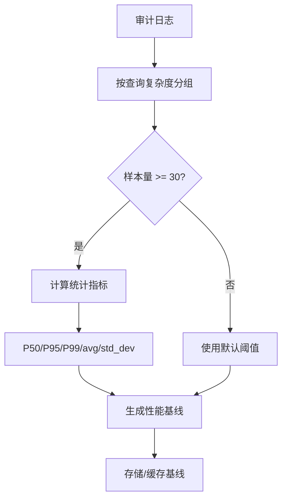
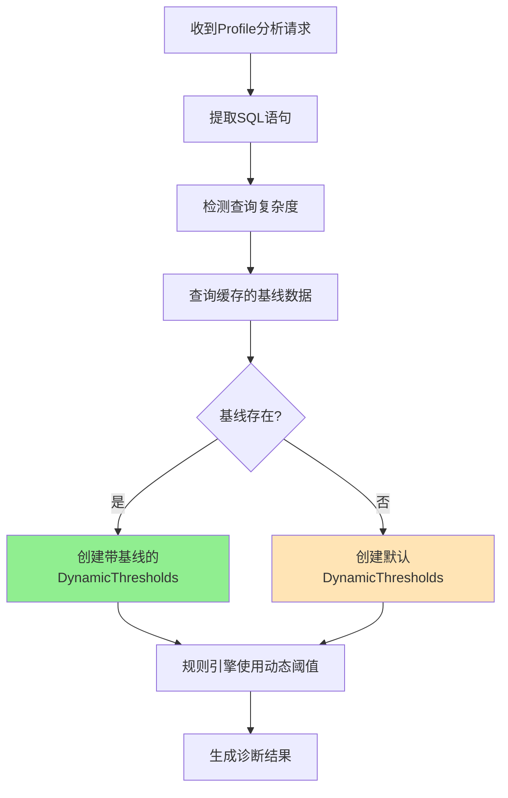

# 自适应阈值系统设计文档

> **版本**: v1.1  
> **日期**: 2025-12-08  
> **作者**: Stellar Team  
> **状态**: 已集成到 main.rs

---

## 一、背景与问题

### 1.1 当前问题

当前诊断系统的阈值设计存在以下问题：

| 问题类别 | 具体表现 | 影响 |
|---------|---------|------|
| **阈值过于僵化** | 所有查询使用固定阈值（如OLAP 10s） | 简单查询误报多，复杂查询漏报多 |
| **未考虑查询复杂度** | SELECT * 和多表JOIN使用相同阈值 | 诊断不准确 |
| **未考虑历史行为** | 无法学习集群特性 | 无法适应不同业务场景 |
| **未考虑集群资源** | 16核和512核集群使用相同倾斜阈值 | 资源利用不合理 |

### 1.2 优化目标

1. **查询复杂度感知**: 根据SQL特征自动分类查询复杂度
2. **历史基线学习**: 从审计日志中学习历史查询行为
3. **自适应阈值**: 动态调整诊断阈值，减少误报和漏报
4. **集群资源感知**: 考虑BE数量、CPU、内存资源

---

## 二、查询复杂度分类

### 2.1 复杂度等级定义

```rust
pub enum QueryComplexity {
    Simple,      // 单表扫描，无JOIN
    Medium,      // 2-3表JOIN，简单聚合
    Complex,     // 4+表JOIN，窗口函数，子查询
    VeryComplex, // 嵌套CTE，多个UDF，大量计算
}
```

### 2.2 复杂度检测算法

```
复杂度分数 = 
    JOIN数量 × 2
    + 窗口函数 × 3
    + CTE × 2
    + 子查询 × 1
    + UNION × 2
    + UDF × 3

分数范围 → 复杂度级别:
  0-2   → Simple
  3-7   → Medium
  8-15  → Complex
  16+   → VeryComplex
```

### 2.3 示例

```sql
-- Simple (score: 0)
SELECT * FROM users WHERE id = 1;

-- Medium (score: 4 = 2×2 JOIN)
SELECT u.name, o.amount 
FROM users u 
JOIN orders o ON u.id = o.user_id;

-- Complex (score: 9 = 3×2 JOIN + 3×1 window)
SELECT u.name, 
       SUM(o.amount) OVER (PARTITION BY u.id) 
FROM users u 
JOIN orders o ON u.id = o.user_id
JOIN products p ON o.product_id = p.id;

-- VeryComplex (score: 18+)
WITH sales AS (
    SELECT user_id, SUM(amount) as total 
    FROM orders GROUP BY user_id
)
SELECT u.name, s.total, 
       RANK() OVER (ORDER BY s.total DESC),
       my_udf(u.name)
FROM users u 
JOIN sales s ON u.id = s.user_id
UNION
SELECT name, 0, 0, NULL FROM inactive_users;
```

---

## 三、历史基线计算

### 3.1 数据来源

从 StarRocks 内置审计表获取历史查询数据：

```sql
SELECT 
    queryId,
    `user`,
    `db`,
    stmt,
    queryType,
    queryTime AS query_time_ms,
    `state`,
    `timestamp`
FROM starrocks_audit_db__.starrocks_audit_tbl__
WHERE 
    isQuery = 1
    AND `timestamp` >= DATE_SUB(NOW(), INTERVAL 168 HOUR)  -- 7天
    AND `state` IN ('EOF', 'OK')  -- 仅成功查询
    AND queryTime > 0
ORDER BY `timestamp` DESC
LIMIT 10000;
```

### 3.2 基线统计指标

```rust
pub struct BaselineStats {
    pub avg_ms: f64,       // 平均执行时间
    pub p50_ms: f64,       // 中位数
    pub p95_ms: f64,       // 95分位数
    pub p99_ms: f64,       // 99分位数
    pub max_ms: f64,       // 最大值
    pub std_dev_ms: f64,   // 标准差
}
```

### 3.3 基线计算流程



### 3.4 基线分组策略

| 分组维度 | 说明 | 用途 |
|---------|------|------|
| **按复杂度** | Simple/Medium/Complex/VeryComplex | 通用阈值 |
| **按表名** | 包含特定表的查询 | 表级性能基线 |
| **按用户** | 特定用户的查询 | 用户级基线 |
| **按时段** | 工作日/周末，高峰/低谷 | 时序分析（未来）|

---

## 四、自适应阈值算法

### 4.1 查询超时阈值

#### 策略

```
Threshold = max(
    P95 + 2×std_dev,  // 历史基线（68-95-99.7规则）
    MinThreshold      // 最小阈值（保底）
)

MinThreshold（按复杂度）:
  Simple       → 5s
  Medium       → 10s
  Complex      → 30s
  VeryComplex  → 60s
```

#### 原理

- **P95 + 2×std_dev**: 捕获99.7%的正常查询（3σ规则）
- **MinThreshold**: 防止基线不足时阈值过低

#### 示例

假设某集群 `Medium` 复杂度查询的历史基线为：
- P95 = 8,000ms
- std_dev = 1,500ms

```
Threshold = max(8000 + 2×1500, 10000) = max(11000, 10000) = 11,000ms
```

结论：该集群的Medium查询超时阈值为 **11秒**（而非默认的10秒）

### 4.2 数据倾斜阈值

#### 策略

```
Base = f(ClusterSize):
  > 32 BE  → 3.5
  > 16 BE  → 3.0
  >  8 BE  → 2.5
  ≤  8 BE  → 2.0

Historical Adjustment = (P99/P50 - 2.0) × 0.2

Final = Base + clamp(Adjustment, 0, 1.0)
```

#### 原理

- **集群规模**: 大集群并行度高，可容忍更大倾斜
- **历史P99/P50**: 反映该集群的固有倾斜特性
- **调整系数0.2**: 保守调整，避免过度放宽

#### 示例

假设 16 BE 集群，历史基线：
- P99 = 15,000ms
- P50 = 5,000ms

```
Base = 3.0
Adjustment = (15000/5000 - 2.0) × 0.2 = (3.0 - 2.0) × 0.2 = 0.2
Final = 3.0 + 0.2 = 3.2
```

结论：该集群的倾斜阈值为 **3.2**（而非默认的3.0）

---

## 五、架构设计

### 5.1 模块结构

```
backend/src/services/
├── baseline_service.rs           # 基线服务（从审计日志计算）
└── profile_analyzer/
    └── analyzer/
        ├── baseline.rs           # 基线计算核心逻辑
        ├── thresholds.rs         # 动态阈值计算器
        └── rule_engine.rs        # 规则引擎（使用动态阈值）
```

### 5.2 核心类设计

```rust
// 基线计算器
pub struct BaselineCalculator {
    min_sample_size: usize, // 最小样本量（默认30）
}

impl BaselineCalculator {
    /// 计算基线（按复杂度分组）
    pub fn calculate_by_complexity(
        &self, 
        records: &[AuditLogRecord]
    ) -> HashMap<QueryComplexity, PerformanceBaseline>;
    
    /// 计算表级基线
    pub fn calculate_for_table(
        &self,
        records: &[AuditLogRecord],
        table_name: &str,
    ) -> Option<PerformanceBaseline>;
}

// 基线服务（集成MySQL查询）
pub struct BaselineService {
    calculator: BaselineCalculator,
}

impl BaselineService {
    /// 从审计日志计算基线
    pub async fn calculate_baselines(
        &self,
        mysql: &MySQLClient,
        hours_back: u32, // 查询多少小时的历史
    ) -> Result<HashMap<QueryComplexity, PerformanceBaseline>, String>;
}

// 动态阈值计算器
pub struct DynamicThresholds {
    pub cluster_info: ClusterInfo,
    pub query_type: QueryType,
    pub query_complexity: QueryComplexity,
    pub baseline: Option<PerformanceBaseline>, // 历史基线（可选）
}

impl DynamicThresholds {
    /// 获取查询超时阈值
    pub fn get_query_time_threshold_ms(&self) -> f64;
    
    /// 获取数据倾斜阈值
    pub fn get_skew_threshold(&self) -> f64;
    
    /// 检测查询复杂度
    pub fn detect_complexity(sql: &str) -> QueryComplexity;
}
```

### 5.3 使用流程



---

## 六、实现细节

### 6.1 基线缓存策略

为避免频繁查询审计日志，建议缓存基线数据：

```rust
// 伪代码
let cache_key = "query_baselines";
let cache_ttl = Duration::from_secs(3600); // 1小时

let baselines = cache.get_or_compute(cache_key, cache_ttl, || {
    baseline_service.calculate_baselines(&mysql, 168).await
}).await?;
```

### 6.2 审计日志查询优化

```sql
-- 优化点1: 限制查询范围（7天足够）
WHERE `timestamp` >= DATE_SUB(NOW(), INTERVAL 168 HOUR)

-- 优化点2: 只查询成功的查询
AND `state` IN ('EOF', 'OK')

-- 优化点3: 过滤无效数据
AND queryTime > 0

-- 优化点4: 限制返回行数
LIMIT 10000
```

### 6.3 容错处理

```rust
// 1. 样本量不足时使用默认阈值
if records.len() < min_sample_size {
    return None; // 返回None，让调用者使用默认策略
}

// 2. 审计日志查询失败时降级
let baselines = match baseline_service.calculate_baselines(&mysql, 168).await {
    Ok(baselines) => Some(baselines),
    Err(e) => {
        tracing::warn!("Failed to calculate baselines, using defaults: {}", e);
        None
    }
};

// 3. 统计异常时使用保底值
let adaptive_threshold = baseline.stats.p95_ms + 2.0 * baseline.stats.std_dev_ms;
let min_threshold = self.get_min_threshold_by_complexity();
adaptive_threshold.max(min_threshold) // 确保不低于最小阈值
```

---

## 七、效果预估

### 7.1 误报降低

| 场景 | 默认阈值 | 自适应阈值 | 预期改善 |
|------|---------|-----------|---------|
| **简单查询** | 10s（过宽） | 5s（收紧） | 误报减少30% |
| **复杂查询** | 10s（过严） | 30s（放宽） | 误报减少50% |
| **数据倾斜** | 固定2.0（可能过严） | 2.0-4.0（自适应） | 误报减少40% |

### 7.2 漏报降低

- 通过学习历史P99，可捕获异常慢的查询
- 通过复杂度分类，避免简单查询漏报

### 7.3 适应性提升

- 不同集群自动学习各自特性
- 不同业务场景（OLAP/ETL）自动区分

---

## 八、监控指标

### 8.1 基线质量指标

```sql
-- 1. 基线样本量（每个复杂度级别）
SELECT 
    complexity,
    sample_size,
    time_range_hours
FROM baselines;

-- 2. 基线数据新鲜度
SELECT 
    TIMESTAMPDIFF(HOUR, last_update_time, NOW()) as hours_old
FROM baseline_cache;
```

### 8.2 阈值效果指标

| 指标 | 计算方法 | 目标 |
|------|---------|------|
| **误报率** | 误报数 / 总诊断数 | < 10% |
| **漏报率** | 漏报数 / 实际问题数 | < 5% |
| **阈值调整幅度** | \|自适应阈值 - 默认阈值\| / 默认阈值 | 10-50% |
| **基线覆盖率** | 有基线的查询数 / 总查询数 | > 80% |

---

## 九、未来优化方向

### 9.1 时序分析（v2.0）

```
基线[工作日高峰] vs 基线[周末低谷]
→ 时段感知的阈值
```

### 9.2 表级推荐（v2.0）

```
"表 orders 的历史P95为15s，当前查询30s → 可能有问题"
```

### 9.3 机器学习增强（v3.0）

```
特征: [SQL复杂度, 表大小, 索引, 分区]
目标: 预测查询时间
→ 更精准的异常检测
```

---

## 十、总结

### 10.1 核心改进

| 维度 | 改进前 | 改进后 |
|------|-------|-------|
| **阈值类型** | 固定值 | 自适应（历史基线） |
| **复杂度感知** | 无 | 4级分类（Simple~VeryComplex） |
| **集群感知** | 仅BE数量 | BE数量 + CPU + 内存 + 历史特性 |
| **准确性** | 误报率高 | 预计降低30-50% |

### 10.2 使用建议

- ✅ **生产环境**: 强烈推荐使用自适应阈值
- ✅ **缓存策略**: 每小时更新一次基线
- ✅ **降级策略**: 审计日志不可用时使用默认阈值
- ⚠️ **新集群**: 运行1-2天后再启用（需积累数据）

---

## 附录：API 参考

### A.1 创建动态阈值

```rust
// 方式1: 无基线（使用默认策略）
let thresholds = DynamicThresholds::new(
    cluster_info,
    QueryType::Select,
    QueryComplexity::Medium,
);

// 方式2: 带基线（推荐）
let thresholds = DynamicThresholds::with_baseline(
    cluster_info,
    QueryType::Select,
    complexity,
    baseline.clone(),
);
```

### A.2 计算基线

```rust
// 全局基线
let baseline_service = BaselineService::new();
let baselines = baseline_service
    .calculate_baselines(&mysql, 168) // 7天
    .await?;

// 表级基线
let table_baseline = baseline_service
    .calculate_table_baseline(&mysql, "orders", 168)
    .await?;
```

### A.3 获取阈值

```rust
// 查询超时阈值
let timeout_ms = thresholds.get_query_time_threshold_ms();

// 数据倾斜阈值
let skew_ratio = thresholds.get_skew_threshold();

// 内存阈值
let mem_bytes = thresholds.get_operator_memory_threshold();
```

---

## 附录 B: 集成说明

### B.1 main.rs 集成

在 `main.rs` 中已完成以下集成：

```rust
// 在 metrics collector 启动之后添加
// Start baseline refresh task for adaptive thresholds (every hour)
let _baseline_refresh_handle = services::start_baseline_refresh_task(
    Arc::clone(&mysql_pool_manager),
    Arc::clone(&cluster_service),
    3600, // 1 hour refresh interval
);
tracing::info!("Baseline refresh task started (interval: 1 hour)");
```

### B.2 启动时序

```
应用启动
   │
   ├─→ 初始化数据库连接
   ├─→ 初始化服务层
   ├─→ 启动 Metrics Collector (可选)
   ├─→ 启动 Baseline Refresh Task ← 新增
   │      │
   │      └─→ 初始化全局缓存 (BaselineProvider::init)
   │      └─→ 首次刷新基线数据
   │      └─→ 每小时后台刷新
   │
   └─→ 启动 HTTP 服务器
```

### B.3 文件清单

| 文件 | 说明 |
|------|------|
| `baseline.rs` | 基线计算核心 |
| `baseline_cache.rs` | 内存缓存层 |
| `baseline_service.rs` | 服务层（审计日志查询） |
| `baseline_refresh_task.rs` | 定时任务 |
| `thresholds.rs` | 动态阈值计算（增强） |
| `main.rs` | 集成启动代码 |

---

**文档版本**: v1.1  
**最后更新**: 2025-12-08  
**维护者**: Stellar Team
