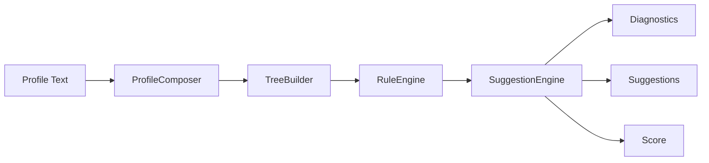
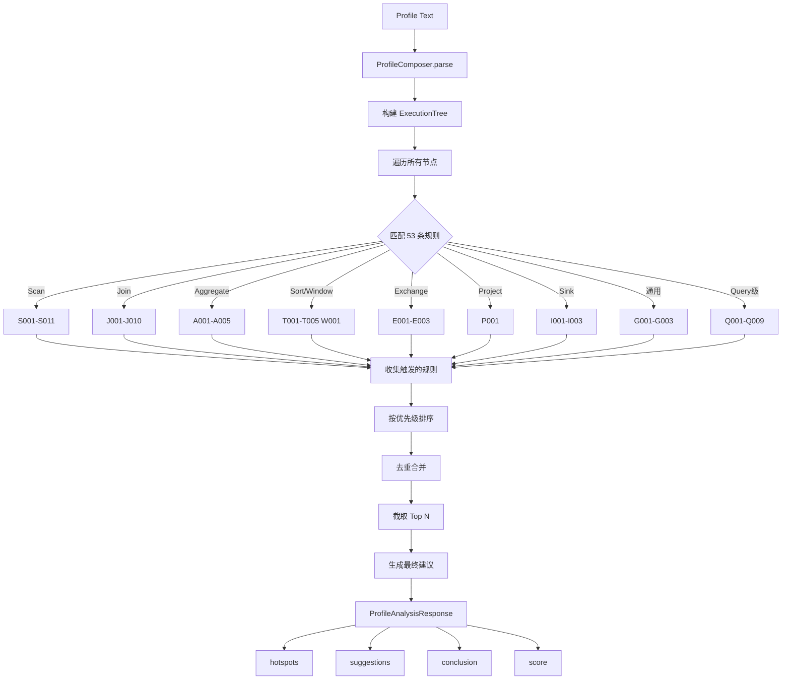
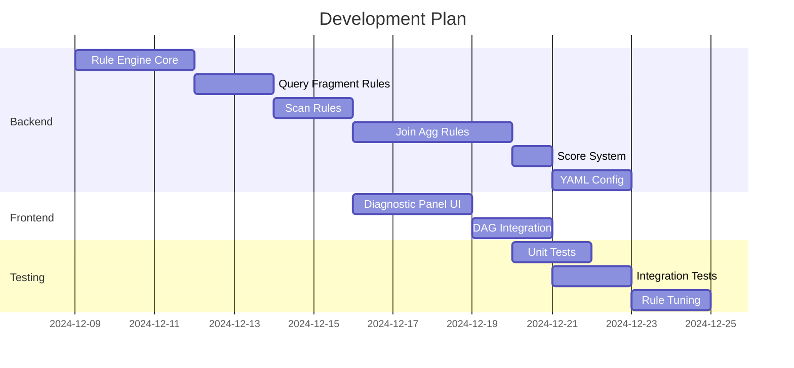
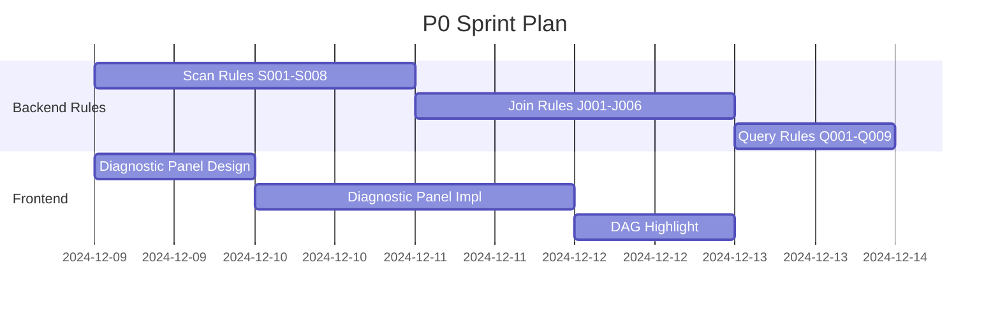

# Query Profile 诊断建议系统设计文档

> **版本**: v1.5  
> **日期**: 2024-12  
> **作者**: Stellar Team  
> **状态**: 设计完善阶段 (99分)  
> **更新**: 
> - v1.5 (2024-12-04) **完善至99分**: 新增 OlapTableSink 规则 (I001-I003)，新增阈值调优指南 (4.14)，新增规则冲突处理策略 (4.15)，新增参数调优映射 (4.16)，新增建议生成流程 (4.17)，规则总数 53 条
> - v1.4 (2024-12-04) **深度反思修正**: 修复 Sort 指标严重错误 (MaxBufferedBytes→OperatorPeakMemoryUsage)，修正 Merge 指标名 (6-PendingStageTime)，新增 T003/T004/J010/P001/L001 规则，新增指标字典章节
> - v1.3 (2024-12-04) 深度评估修正: Sort/Aggregate/Window 规则修复，新增 S011/A004/A005/W001/J009 规则
> - v1.2 (2024-12-04) 基于源码深度评估，修复规则 BUG，新增 S009/S010/J007/J008 规则
> - v1.1 (2024-12) 基于 StarRocks ExplainAnalyzer.java 源码深度对齐

---

## 一、背景与目标

### 1.1 背景

StarRocks Query Profile 包含丰富的执行指标信息，但对于普通用户来说：
- 指标繁多，难以快速定位问题
- 缺乏专业知识判断指标是否异常
- 不知道如何根据指标进行优化

### 1.2 目标

构建一个智能诊断建议系统，实现：
1. **自动检测**：根据规则自动识别性能瓶颈
2. **问题归因**：明确告知问题原因
3. **优化建议**：提供可操作的解决方案
4. **量化评估**：通过评分反映查询健康度

### 1.3 参考资料

| 来源 | 内容 | 链接 |
|------|------|------|
| StarRocks 官方 | Query Profile 概述 | [link](https://docs.starrocks.io/zh/docs/best_practices/query_tuning/query_profile_overview/) |
| StarRocks 官方 | 查询优化方案 | [link](https://docs.starrocks.io/zh/docs/best_practices/query_tuning/query_profile_tuning_recipes/) |
| StarRocks 官方 | 查询概要指标 | [link](https://docs.starrocks.io/zh/docs/best_practices/query_tuning/query_profile_operator_metrics/) |
| 阿里云 EMR | Query Profile 诊断建议 | [link](https://help.aliyun.com/zh/emr/emr-serverless-starrocks/diagnosis-and-suggestions-for-query-profiles) |
| StarRocks 源码 | ExplainAnalyzer.java | fe/fe-core/src/main/java/com/starrocks/sql/ExplainAnalyzer.java |

---

## 二、整体架构

### 2.1 系统架构图

```
┌─────────────────────────────────────────────────────────────────────────────┐
│                          Profile Diagnostic System                           │
├─────────────────────────────────────────────────────────────────────────────┤
│                                                                              │
│  ┌──────────────┐    ┌──────────────┐    ┌──────────────┐    ┌────────────┐│
│  │   Profile    │    │    Rule      │    │  Suggestion  │    │   Output   ││
│  │   Parser     │───►│   Engine     │───►│   Engine     │───►│  Renderer  ││
│  └──────────────┘    └──────────────┘    └──────────────┘    └────────────┘│
│         │                   │                   │                   │       │
│         │                   │                   │                   │       │
│         ▼                   ▼                   ▼                   ▼       │
│  ┌──────────────┐    ┌──────────────┐    ┌──────────────┐    ┌────────────┐│
│  │  Structured  │    │    Rules     │    │ Diagnostics  │    │    API     ││
│  │   Profile    │    │   Config     │    │  & Score     │    │  Response  ││
│  │    Data      │    │  (YAML/JSON) │    │              │    │            ││
│  └──────────────┘    └──────────────┘    └──────────────┘    └────────────┘│
│                                                                              │
└─────────────────────────────────────────────────────────────────────────────┘
```

### 2.2 数据流图



---

## 三、规则引擎设计

### 3.1 技术选型

| 方案 | 优点 | 缺点 | 适用场景 |
|------|------|------|---------|
| 硬编码规则 | 简单、性能高 | 难扩展、难维护 | 规则少且稳定 |
| YAML/JSON配置 | 易修改、可热加载 | 复杂条件难表达 | 中等复杂度 |
| **DSL规则引擎** | 灵活、可扩展、规则可视化 | 需设计DSL | ✅ 推荐 |
| 外部规则引擎(Drools) | 功能强大 | 依赖重、学习成本高 | 超大规模系统 |

**选型结论**：采用**轻量级 DSL 规则引擎 + YAML 配置**方案

### 3.2 规则模型设计

```rust
/// 诊断规则定义
pub struct DiagnosticRule {
    /// 规则唯一标识
    pub id: String,
    /// 规则名称
    pub name: String,
    /// 规则层级：Query/Fragment/Operator
    pub level: RuleLevel,
    /// 适用的算子类型（可选）
    pub operator_type: Option<OperatorType>,
    /// 触发条件列表（AND关系）
    pub conditions: Vec<Condition>,
    /// 严重程度
    pub severity: Severity,
    /// 消息模板（支持变量替换）
    pub message_template: String,
    /// 优化建议列表
    pub suggestions: Vec<String>,
    /// 是否启用
    pub enabled: bool,
    /// 优先级（数字越小越先执行）
    pub priority: u32,
}

/// 规则层级
pub enum RuleLevel {
    Query,      // 查询级别
    Fragment,   // Fragment级别  
    Operator,   // 算子级别
}

/// 算子类型
pub enum OperatorType {
    Scan,       // OLAP_SCAN, CONNECTOR_SCAN
    Join,       // HASH_JOIN, NEST_LOOP_JOIN
    Aggregate,  // AGGREGATE
    Exchange,   // EXCHANGE
    Sort,       // SORT, MERGE
    Window,     // ANALYTIC
    Project,    // PROJECT
    Other,
}

/// 严重程度
pub enum Severity {
    Info,       // 信息提示
    Warning,    // 警告
    Error,      // 错误
    Critical,   // 严重
}
```

### 3.3 条件表达式设计

```rust
/// 条件表达式（支持嵌套组合）
pub enum Condition {
    /// 阈值比较：metric op value
    /// 例：OperatorTotalTime > 5000000000 (5s in ns)
    Threshold {
        metric: String,
        op: CompareOp,
        value: f64,
    },
    
    /// 比率比较：numerator / denominator op value
    /// 例：ScanTime / ExecutionWallTime > 0.5
    Ratio {
        numerator: String,
        denominator: String,
        op: CompareOp,
        value: f64,
    },
    
    /// 聚合比较：agg(metric) op value
    /// 例：max(RowsRead) / avg(RowsRead) > 2.0
    Aggregation {
        agg_func: AggFunc,  // max, min, avg, sum
        metric: String,
        compare_agg: Option<AggFunc>,
        compare_metric: Option<String>,
        op: CompareOp,
        value: f64,
    },
    
    /// 存在性检查
    Exists { metric: String },
    
    /// 字符串匹配
    StringMatch {
        field: String,
        pattern: String,
        match_type: MatchType,  // Equals, Contains, Regex
    },
    
    /// 组合条件
    And(Vec<Condition>),
    Or(Vec<Condition>),
    Not(Box<Condition>),
}

pub enum CompareOp { Gt, Gte, Lt, Lte, Eq, Ne }
pub enum AggFunc { Max, Min, Avg, Sum, Count }
```

### 3.4 规则上下文

```rust
/// 规则执行上下文
pub struct RuleContext {
    /// 当前节点的指标
    pub metrics: HashMap<String, f64>,
    /// 当前节点的字符串属性
    pub info_strings: HashMap<String, String>,
    /// 节点类型
    pub node_type: String,
    /// Plan Node ID
    pub plan_node_id: Option<i32>,
    /// Fragment ID
    pub fragment_id: Option<String>,
    /// 父节点上下文（用于跨节点比较）
    pub parent: Option<Box<RuleContext>>,
    /// 子节点上下文列表
    pub children: Vec<RuleContext>,
    /// 全局 Summary 指标
    pub summary_metrics: HashMap<String, f64>,
}

impl RuleContext {
    /// 获取指标值
    pub fn get_metric(&self, name: &str) -> Option<f64>;
    
    /// 获取聚合值（跨实例）
    pub fn get_aggregated(&self, name: &str, agg: AggFunc) -> Option<f64>;
    
    /// 计算比率
    pub fn calc_ratio(&self, numerator: &str, denominator: &str) -> Option<f64>;
}
```

---

## 四、诊断规则详细设计

### 4.1 规则分层体系

```
┌─────────────────────────────────────────────────────────────┐
│                     Query Level Rules                        │
│  Q001: 执行时间过长  Q002: CPU利用率低  Q003: 内存使用高      │
│  Q004: Spill数据量大  Q005: 网络占比高  Q006: 扫描占比高      │
└─────────────────────────────────────────────────────────────┘
                              │
                              ▼
┌─────────────────────────────────────────────────────────────┐
│                    Fragment Level Rules                      │
│  F001: 实例执行时间倾斜  F002: 实例内存分配不均              │
│  F003: Fragment准备时间过长                                  │
└─────────────────────────────────────────────────────────────┘
                              │
                              ▼
┌─────────────────────────────────────────────────────────────┐
│                    Operator Level Rules                      │
├──────────┬──────────┬──────────┬──────────┬────────────────┤
│   Scan   │   Join   │   Agg    │ Exchange │     Other      │
│  S001-   │  J001-   │  A001-   │  E001-   │   G001-        │
│  S010    │  J008    │  A005    │  E005    │   G005         │
└──────────┴──────────┴──────────┴──────────┴────────────────┘
```

### 4.2 Query 级规则

> **热点阈值标准**（参考 StarRocks `ExplainAnalyzer.java:1546-1550` 源码）：
> - `totalTimePercentage > 30%` → **MostConsuming**（最耗时，红色高亮）
> - `totalTimePercentage > 15%` → **SecondMostConsuming**（次耗时，橙色高亮）
> - `metricTime / totalTime > 0.3` → **TimeConsumingMetric**（耗时指标高亮）

| 规则ID | 名称 | 条件 | 严重度 | 建议 |
|--------|------|------|--------|------|
| Q001 | 执行时间过长 | `QueryExecutionWallTime > 5min` | Error | 检查是否存在数据倾斜；优化查询计划 |
| Q002 | CPU利用率低 | `QueryCumulativeCpuTime / QueryExecutionWallTime < 0.3` | Warning | 检查是否存在等待；增加并行度 |
| Q003 | 内存使用过高 | 🔧 修正见下方详细条件 | Error | 降低 exec_mem_limit；增加 BE 内存 |
| Q004 | Spill数据量大 | `QuerySpillBytes > 1GB` | Warning | 增加内存限制；升级到 SR 3.2+ |
| Q005 | 网络传输占比高 | `QueryCumulativeNetworkTime / QueryExecutionWallTime > 0.3` | Warning | 评估 Join 策略；启用 exchange compaction |
| Q006 | 扫描占比过高 | `QueryCumulativeScanTime / QueryExecutionWallTime > 0.5` | Warning | 添加过滤条件；使用索引 |
| Q007 | Profile收集慢 | `CollectProfileTime > 100ms` | Info | 降低 pipeline_profile_level |
| Q008 | 调度时间过长 | `QueryPeakScheduleTime / QueryExecutionWallTime > 0.3` | Warning | 检查 Pipeline 调度瓶颈；增加并行度 |
| Q009 | 结果传输慢 | `ResultDeliverTime / QueryExecutionWallTime > 0.2` | Info | 检查网络带宽；减少结果集大小 |

> **Q003 详细条件** (🔧 v1.2 修正)：
> 
> 由于 `QueryMemoryLimit` 可能为 -1（无限制），需要使用组合条件：
> ```yaml
> conditions:
>   - type: or
>     sub_conditions:
>       # 条件1：有内存限制时，使用率超过80%
>       - type: and
>         sub_conditions:
>           - metric: "QueryMemoryLimit" > 0
>           - metric: "QueryPeakMemoryUsagePerNode / QueryMemoryLimit" > 0.8
>       # 条件2：无内存限制时，使用绝对阈值 10GB
>       - type: and
>         sub_conditions:
>           - metric: "QueryMemoryLimit" <= 0
>           - metric: "QueryPeakMemoryUsagePerNode" > 10GB
> ```

### 4.3 Fragment 级规则

| 规则ID | 名称 | 条件 | 严重度 | 建议 |
|--------|------|------|--------|------|
| F001 | 执行时间倾斜 | `max(InstanceTime) / avg(InstanceTime) > 2` | Warning | 检查数据分布；优化分桶策略 |
| F002 | 内存分配不均 | `max(InstanceMemory) / avg(InstanceMemory) > 2` | Warning | 检查数据倾斜 |
| F003 | 准备时间过长 | `FragmentInstancePrepareTime > 1s` | Info | 检查元数据加载 |

### 4.4 Scan 算子规则

参考 [StarRocks 查询优化方案](https://docs.starrocks.io/zh/docs/best_practices/query_tuning/query_profile_tuning_recipes/)

```yaml
# S001: 数据倾斜检测
- id: S001
  name: "Scan 数据倾斜"
  level: operator
  operator_type: SCAN
  conditions:
    - type: aggregation
      agg_func: max
      metric: "RowsRead"
      compare_agg: avg
      compare_metric: "RowsRead"
      op: ">"
      value: 2.0
  severity: warning
  message: "Scan 存在数据倾斜，max/avg 比率为 {ratio:.2f}"
  suggestions:
    - "检查并优化分桶键设置，确保数据更均匀分布"
    - "考虑增加分桶数量"
    - "检查数据导入时是否存在热点写入"

# S002: IO倾斜检测
- id: S002
  name: "Scan IO倾斜"
  level: operator
  operator_type: SCAN
  conditions:
    - type: aggregation
      agg_func: max
      metric: "IOTime"
      compare_agg: avg
      compare_metric: "IOTime"
      op: ">"
      value: 2.0
  severity: warning
  message: "Scan IO 耗时存在倾斜，max/avg 比率为 {ratio:.2f}"
  suggestions:
    - "检查节点 IO 使用率是否不均"
    - "检查存储设备是否存在性能问题"

# S003: 过滤效果差
# 🔧 BUG修正: OutputRows 改为 RowsRead (Scan 算子没有 OutputRows 指标)
- id: S003
  name: "Scan 过滤未生效"
  level: operator
  operator_type: SCAN
  conditions:
    - type: ratio
      numerator: "RowsRead"         # 🔧 修正: UniqueMetrics 中的过滤后行数
      denominator: "RawRowsRead"    # UniqueMetrics 中的原始扫描行数
      op: ">"
      value: 0.8
    - type: threshold
      metric: "RawRowsRead"
      op: ">"
      value: 1000000  # 超过100万行才检测
  severity: warning
  message: "Scan 过滤效果差，输出/扫描比率为 {ratio:.1%}"
  suggestions:
    - "检查是否可以添加更有效的过滤条件"
    - "考虑添加 Bloom Filter 或 Bitmap 索引"
    - "检查查询条件是否包含函数导致无法下推"

# S004: 缺少过滤下推
# 参考 ExplainAnalyzer.java:1747 的 PushdownPredicates 指标
# 🔧 BUG修正: 指标名不需要前缀，增加行数阈值避免误报
- id: S004
  name: "谓词未下推"
  level: operator
  operator_type: SCAN
  conditions:
    - type: threshold
      metric: "PushdownPredicates"    # 🔧 修正: 不需要 UniqueMetrics. 前缀
      op: "=="
      value: 0
    - type: ratio
      # PredFilter 表示在表达式层过滤的行数占比
      numerator: "PredFilterRows"     # 🔧 修正: 不需要前缀
      denominator: "RawRowsRead"      # 🔧 修正: 不需要前缀
      op: ">"
      value: 0.1
    - type: threshold                 # 🔧 新增: 只有扫描量较大时才检测
      metric: "RawRowsRead"
      op: ">"
      value: 10000
  severity: warning
  message: "谓词未能下推到存储层，{pred_filter_rows} 行（{ratio:.1%}）在表达式层过滤"
  suggestions:
    - "将谓词重写为简单比较（避免 %LIKE% 和宽 OR 链）"
    - "添加 zonemap/Bloom 索引以便下推"
    - "考虑使用物化视图预计算"
    - "检查列类型是否支持下推（如 JSON 列可能不支持）"

# S005: IO线程池饥饿
- id: S005
  name: "IO线程池饱和"
  level: operator
  operator_type: SCAN
  conditions:
    - type: threshold
      metric: "IOTaskWaitTime"
      op: ">"
      value: 1000000000  # 1s in ns
    - type: threshold
      metric: "PeakIOTasks"
      op: "<"
      value: 10
  severity: warning
  message: "IO 线程池可能已饱和，等待时间 {wait_time}"
  suggestions:
    - "增加 BE 上的 max_io_threads 配置"
    - "扩大存储缓存以让更多任务并行运行"

# S006: Rowset碎片化
- id: S006
  name: "Rowset 碎片化"
  level: operator
  operator_type: SCAN
  conditions:
    - type: threshold
      metric: "RowsetsReadCount"
      op: ">"
      value: 100
    - type: threshold
      metric: "SegmentInitTime"
      op: ">"
      value: 500000000  # 500ms
  severity: warning
  message: "Rowset 数量过多 ({rowsets_count})，初始化耗时 {init_time}"
  suggestions:
    - "触发手动 Compaction"
    - "批量合并小型导入任务"

# S007: 冷存储访问
- id: S007
  name: "冷/慢存储访问"
  level: operator
  operator_type: SCAN
  conditions:
    - type: ratio
      numerator: "IOTime"
      denominator: "ScanTime"
      op: ">"
      value: 0.8
    - type: threshold
      metric: "BytesRead"
      op: ">"
      value: 1073741824  # 1GB
  severity: warning
  message: "Scan 可能正在访问冷存储，IO 耗时占比 {ratio:.1%}"
  suggestions:
    - "将热数据移动到 NVMe/SSD"
    - "启用存储缓存"
    - "如扫描 S3/HDFS，提高 remote_cache_capacity"

# S008: ZoneMap 过滤效果差
# 🔧 BUG修正: 指标名不需要前缀
- id: S008
  name: "ZoneMap 索引未生效"
  level: operator
  operator_type: SCAN
  conditions:
    - type: threshold
      metric: "ZoneMapIndexFilterRows"  # 🔧 修正: 不需要 UniqueMetrics. 前缀
      op: "=="
      value: 0
    - type: threshold
      metric: "RawRowsRead"             # 🔧 修正: 不需要前缀
      op: ">"
      value: 100000
  severity: info
  message: "ZoneMap 索引未能过滤数据，建议检查查询条件"
  suggestions:
    - "确保查询条件包含排序键或前缀列"
    - "检查数据是否按排序键有序存储"
    - "对于范围查询，确保使用合适的数据类型"

# S009: 缓存命中率低 (🆕 v1.2 新增)
- id: S009
  name: "存储缓存命中率低"
  level: operator
  operator_type: SCAN
  conditions:
    - type: ratio
      numerator: "CachedPagesNum"
      denominator: "ReadPagesNum"
      op: "<"
      value: 0.3
    - type: threshold
      metric: "ReadPagesNum"
      op: ">"
      value: 1000
  severity: info
  message: "存储缓存命中率仅 {ratio:.1%}，大量数据从磁盘读取"
  suggestions:
    - "增加 BE 的 storage_page_cache_limit 配置"
    - "检查数据访问模式是否有热点"
    - "考虑使用 SSD 存储热数据"

# S010: Scan Runtime Filter 未生效 (🆕 v1.2 新增)
- id: S010
  name: "Scan Runtime Filter 未生效"
  level: operator
  operator_type: SCAN
  conditions:
    - type: threshold
      metric: "RuntimeFilterRows"
      op: "=="
      value: 0
    - type: threshold
      metric: "RawRowsRead"
      op: ">"
      value: 100000
  severity: info
  message: "Runtime Filter 未能在 Scan 阶段过滤数据"
  suggestions:
    - "检查 Runtime Filter 是否正确下推到 Scan"
    - "确认 Join 条件是否支持生成 Runtime Filter"
    - "检查 enable_global_runtime_filter 配置"

# S011: 累积软删除过多 (🆕 v1.3 新增)
# 参考官方文档: "累积的软删除 – 大量的 DeleteFilterRows 表示大量使用软删除"
- id: S011
  name: "累积软删除过多"
  level: operator
  operator_type: SCAN
  conditions:
    - type: ratio
      numerator: "DelVecFilterRows"
      denominator: "RawRowsRead"
      op: ">"
      value: 0.3
    - type: threshold
      metric: "RawRowsRead"
      op: ">"
      value: 100000
  severity: warning
  message: "软删除行占比 {ratio:.1%}，影响扫描性能"
  suggestions:
    - "运行 BE compaction 清除墓碑并合并删除位图"
    - "考虑定期执行 OPTIMIZE TABLE 操作"
    - "检查是否存在频繁的 DELETE 操作"
```

> **Scan 算子指标分组**（参考 `ExplainAnalyzer.java:1044-1121`）：
> 
> | 分组 | 包含指标 | 说明 |
> |------|---------|------|
> | **ScanFilters** | ShortKeyFilter, BitmapIndexFilter, BloomFilterFilter, ZoneMapIndexFilter, PredFilter, GinFilter, VectorIndexFilter, DelVecFilter, RuntimeFilter | 各种过滤器的行数和耗时 |
> | **RowProcessing** | RawRowsRead, RowsRead, DictDecode, DictDecodeCount, ChunkCopy | 行处理相关 |
> | **IOMetrics** | IOTime, BytesRead, CompressedBytesRead, UncompressedBytesRead, ReadPagesNum, CachedPagesNum, BlockFetch, BlockSeek, DecompressT | IO 相关指标 |
> | **SegmentProcessing** | TabletCount, SegmentsReadCount, RowsetsReadCount, TotalColumnsDataPageCount, ColumnIteratorInit | 段处理相关 |
> | **IOTask** | IOTaskExecTime, IOTaskWaitTime, SubmitTaskCount, SubmitTaskTime, PrepareChunkSourceTime, MorselsCount, PeakIOTasks | IO 任务调度 |
> | **IOBuffer** | PeakChunkBufferMemoryUsage, PeakChunkBufferSize, ChunkBufferCapacity | IO 缓冲区 |

### 4.5 Join 算子规则

```yaml
# J001: Join结果膨胀
# 🔧 v1.3 修正: OutputRows 改为 PullRowNum (CommonMetrics 中的输出行数)
- id: J001
  name: "Join 结果膨胀"
  level: operator
  operator_type: JOIN
  conditions:
    - type: ratio
      numerator: "PullRowNum"           # 🔧 修正: 使用 CommonMetrics 中的输出行数
      denominator: "ProbeRows"          # UniqueMetrics 中的探测行数
      op: ">"
      value: 2.0
  severity: error
  message: "Join 输出行数是探测侧的 {ratio:.1f} 倍，可能存在笛卡尔积"
  suggestions:
    - "检查 JOIN 条件是否缺失或错误"
    - "验证业务逻辑是否需要 1:N 关联"
    - "考虑添加更精确的关联条件"

# J002: Build表选择不合理
- id: J002
  name: "Build 表选择不合理"
  level: operator
  operator_type: JOIN
  conditions:
    - type: ratio
      numerator: "BuildRows"
      denominator: "ProbeRows"
      op: ">"
      value: 1.0
    - type: threshold
      metric: "HashTableMemoryUsage"
      op: ">"
      value: 1073741824  # 1GB
  severity: warning
  message: "Build 端行数 ({build_rows}) 大于 Probe 端 ({probe_rows})"
  suggestions:
    - "检查统计信息是否收集或过期"
    - "通过设置 disable_join_reorder=true 手动控制 Join 顺序"
    - "执行 ANALYZE TABLE 更新统计信息"

# J003: 不应使用Broadcast
- id: J003
  name: "Broadcast 使用不当"
  level: operator
  operator_type: JOIN
  conditions:
    - type: string_match
      field: "DistributionMode"
      pattern: "BROADCAST"
      match_type: equals
    - type: threshold
      metric: "BytesSent"
      op: ">"
      value: 104857600  # 100MB
  severity: warning
  message: "Broadcast Join 传输数据量过大 ({bytes_sent})"
  suggestions:
    - "在 JOIN 关键字后添加 [shuffle] Hint"
    - "降低 broadcast_row_limit 参数"

# J004: Runtime Filter未生效
# 🔧 BUG修正: 指标名不需要 CommonMetrics. 前缀
# 注意：指标来自 CommonMetrics（参考 ExplainAnalyzer.java:714-720）
- id: J004
  name: "Runtime Filter 未生效"
  level: operator
  operator_type: JOIN
  conditions:
    - type: threshold
      metric: "JoinRuntimeFilterInputRows"  # 🔧 修正: 不需要前缀
      op: ">"
      value: 0
    - type: ratio
      # 计算过滤率：Output / Input > 0.95 表示过滤效果差（仅过滤不到5%）
      numerator: "JoinRuntimeFilterOutputRows"   # 🔧 修正: 不需要前缀
      denominator: "JoinRuntimeFilterInputRows"  # 🔧 修正: 不需要前缀
      op: ">"
      value: 0.95
  severity: info
  message: "Runtime Filter 过滤效果差，仅过滤 {filter_rate:.1%}（输入行数: {input_rows}, 输出行数: {output_rows}）"
  suggestions:
    - "将连接重写为纯等式条件"
    - "确保连接列类型对齐（避免隐式类型转换）"
    - "检查 Runtime Filter 是否被禁用（enable_global_runtime_filter）"

# J005: Hash碰撞严重
- id: J005
  name: "Hash 碰撞严重"
  level: operator
  operator_type: JOIN
  conditions:
    - type: threshold
      metric: "BuildKeysPerBucket%"
      op: ">"
      value: 10
  severity: warning
  message: "Hash 表碰撞严重，平均每桶 {keys_per_bucket:.1f} 个键"
  suggestions:
    - "优化 Join 键选择"
    - "检查数据是否存在大量重复值"

# J006: Shuffle倾斜
- id: J006
  name: "Join Shuffle 倾斜"
  level: operator
  operator_type: JOIN
  conditions:
    - type: aggregation
      agg_func: max
      metric: "ProbeRows"
      compare_agg: avg
      compare_metric: "ProbeRows"
      op: ">"
      value: 3.0
  severity: warning
  message: "Join 数据分布倾斜，max/avg 比率为 {ratio:.2f}"
  suggestions:
    - "切换到更高基数的连接键"
    - "对键添加盐值，如 key || mod(id, 16)"

# J007: 分区 Join 探测开销过高 (🆕 v1.2 新增)
- id: J007
  name: "分区 Join 探测开销高"
  level: operator
  operator_type: JOIN
  conditions:
    - type: threshold
      metric: "PartitionNums"
      op: ">"
      value: 1
    - type: ratio
      numerator: "PartitionProbeOverhead"
      denominator: "SearchHashTableTime"
      op: ">"
      value: 0.5
  severity: warning
  message: "分区探测开销占比 {ratio:.1%}，分区数为 {partition_nums}"
  suggestions:
    - "检查分区数是否合理"
    - "考虑增加内存限制避免过度分区"
    - "检查数据分布是否导致分区不均"

# J008: Runtime Filter 内存占用过高 (🆕 v1.2 新增)
- id: J008
  name: "Runtime Filter 内存占用高"
  level: operator
  operator_type: JOIN
  conditions:
    - type: threshold
      metric: "PartialRuntimeMembershipFilterBytes"
      op: ">"
      value: 104857600  # 100MB
  severity: info
  message: "Runtime Filter 内存占用 {rf_bytes}，可能影响内存预算"
  suggestions:
    - "降低 runtime_filter_max_size 配置"
    - "检查 Join 键基数是否过高"
    - "考虑禁用不必要的 Runtime Filter"

# J009: 非等式回退检测 (🆕 v1.3 新增)
# 参考官方文档: "非等式回退 – 当 operator 类型是 CROSS 或 NESTLOOP 时，不等式或函数阻止了哈希连接"
- id: J009
  name: "Join 退化为 CROSS/NESTLOOP"
  level: operator
  operator_type: JOIN
  conditions:
    - type: string_match
      field: "JoinType"
      pattern: "CROSS|NESTLOOP"
      match_type: regex
  severity: error
  message: "Join 退化为 {join_type}，不等式或函数阻止了哈希连接"
  suggestions:
    - "添加一个真正的等式谓词 (如 a.id = b.id)"
    - "预过滤较大的表以减少笛卡尔积"
    - "检查 JOIN 条件是否包含函数调用导致无法使用哈希连接"
    - "考虑重写查询逻辑避免 CROSS JOIN"

# J010: 探测缓存不友好 (🆕 v1.4 新增)
# 参考官方文档: "缓存不友好的探测 – 当 SearchHashTableTime 占主导时，探测端不是缓存高效的"
- id: J010
  name: "Join 探测缓存不友好"
  level: operator
  operator_type: JOIN
  conditions:
    - type: ratio
      numerator: "SearchHashTableTime"
      denominator: "OperatorTotalTime"
      op: ">"
      value: 0.5
    - type: threshold
      metric: "SearchHashTableTime"
      op: ">"
      value: 500000000  # 500ms
  severity: warning
  message: "Join 探测哈希表时间占比过高 ({ratio:.1%})，可能存在缓存不友好"
  suggestions:
    - "对探测行按连接键排序"
    - "启用 Runtime Filter 减少探测数据量"
    - "检查 Join 键的数据分布是否均匀"
    - "考虑调整 hash_join_push_down_right_table 参数"
```

> **Join 算子指标分组**（参考 `ExplainAnalyzer.java:965-1000`）：
> 
> | 分组 | 包含指标 | 说明 |
> |------|---------|------|
> | **HashTable** | BuildBuckets, BuildKeysPerBucket%, BuildHashTableTime, BuildConjunctEvaluateTime, HashTableMemoryUsage, PartitionNums, PartitionProbeOverhead | 哈希表构建相关 |
> | **ProbeSide** | SearchHashTableTime, probeCount, ProbeConjunctEvaluateTime, CopyRightTableChunkTime, OtherJoinConjunctEvaluateTime, OutputBuildColumnTime, OutputProbeColumnTime, WhereConjunctEvaluateTime | 探测侧相关 |
> | **RuntimeFilter** | RuntimeFilterBuildTime, RuntimeFilterNum, PartialRuntimeMembershipFilterBytes | Runtime Filter 相关 |

### 4.6 Aggregate 算子规则

```yaml
# A001: 本地聚合度低
- id: A001
  name: "本地聚合度低"
  level: operator
  operator_type: AGGREGATE
  conditions:
    - type: ratio
      numerator: "OutputRows"
      denominator: "InputRowCount"
      op: ">"
      value: 0.9
    - type: threshold
      metric: "InputRowCount"
      op: ">"
      value: 100000
  severity: warning
  message: "本地聚合效果差，输出/输入比率为 {ratio:.1%}"
  suggestions:
    - "通过设置 new_planner_agg_stage=1 关闭二阶段聚合"
    - "检查 GROUP BY 键基数是否过高"

# A002: HashTable过大
- id: A002
  name: "聚合 HashTable 过大"
  level: operator
  operator_type: AGGREGATE
  conditions:
    - type: threshold
      metric: "HashTableMemoryUsage"
      op: ">"
      value: 1073741824  # 1GB
  severity: warning
  message: "聚合 HashTable 内存使用过高 ({memory_usage})"
  suggestions:
    - "考虑使用预聚合或物化视图"
    - "检查 GROUP BY 键的基数"
    - "增加 exec_mem_limit"

# A003: 数据倾斜
- id: A003
  name: "聚合数据倾斜"
  level: operator
  operator_type: AGGREGATE
  conditions:
    - type: aggregation
      agg_func: max
      metric: "InputRowCount"
      compare_agg: avg
      compare_metric: "InputRowCount"
      op: ">"
      value: 2.0
  severity: warning
  message: "聚合存在数据倾斜，max/avg 比率为 {ratio:.2f}"
  suggestions:
    - "优化分组键选择"
    - "考虑对热点键单独处理"
    - "向键添加盐列或使用 DISTINCT [skew] 提示"

# A004: 高基数 GROUP BY (🆕 v1.3 新增)
# 参考官方文档: "高基数 GROUP BY – 当 HashTableSize 或 HashTableMemoryUsage 膨胀到内存限制时"
- id: A004
  name: "高基数 GROUP BY"
  level: operator
  operator_type: AGGREGATE
  conditions:
    - type: threshold
      metric: "HashTableSize"
      op: ">"
      value: 10000000  # 1000万个分组
  severity: warning
  message: "GROUP BY 基数过高，HashTable 包含 {hash_table_size} 个分组"
  suggestions:
    - "启用排序流聚合 (enable_streaming_preaggregation = true)"
    - "创建汇总物化视图预聚合数据"
    - "将宽字符串键转换为 INT 类型"
    - "考虑使用近似聚合函数 (如 APPROX_COUNT_DISTINCT)"

# A005: 昂贵的键表达式 (🆕 v1.3 新增)
# 参考官方文档: "昂贵的键表达式 – 当 ExprComputeTime 与 AggComputeTime 相当时"
- id: A005
  name: "GROUP BY 键表达式计算开销高"
  level: operator
  operator_type: AGGREGATE
  conditions:
    - type: ratio
      numerator: "ExprComputeTime"
      denominator: "AggFuncComputeTime"
      op: ">"
      value: 0.5
    - type: threshold
      metric: "ExprComputeTime"
      op: ">"
      value: 100000000  # 100ms
  severity: info
  message: "GROUP BY 键表达式计算占比过高 ({ratio:.1%})"
  suggestions:
    - "在子查询中物化复杂表达式"
    - "将表达式提升为生成列 (Generated Column)"
    - "避免在 GROUP BY 中使用复杂函数"
```

### 4.7 Exchange 算子规则

```yaml
# E001: 网络传输过多
- id: E001
  name: "网络传输数据量过大"
  level: operator
  operator_type: EXCHANGE
  conditions:
    - type: threshold
      metric: "BytesSent"
      op: ">"
      value: 1073741824  # 1GB
  severity: warning
  message: "Exchange 传输数据量过大 ({bytes_sent})"
  suggestions:
    - "评估是否可以使用 Colocate Join"
    - "启用 pipeline_enable_exchange_compaction"
    - "在上游添加更多过滤条件"

# E002: 网络等待过长
- id: E002
  name: "网络等待时间过长"
  level: operator
  operator_type: EXCHANGE
  conditions:
    - type: threshold
      metric: "WaitTime"
      op: ">"
      value: 100000000  # 100ms
  severity: warning
  message: "Exchange 等待时间过长 ({wait_time})"
  suggestions:
    - "检查网络带宽和 QoS 设置"
    - "增加接收器线程池 brpc_num_threads"

# E003: 序列化耗时高
- id: E003
  name: "序列化耗时过高"
  level: operator
  operator_type: EXCHANGE
  conditions:
    - type: ratio
      numerator: "SerializeChunkTime"
      denominator: "OperatorTotalTime"
      op: ">"
      value: 0.3
  severity: info
  message: "序列化占比过高 ({ratio:.1%})"
  suggestions:
    - "检查传输的数据类型是否可优化"
    - "考虑减少传输的列数"
```

### 4.8 Sort/Merge/Window 算子规则

> 🔧 **v1.4 深度修正**: 基于官方指标文档重新验证，修正严重的指标名称错误
> 
> 参考官方文档:
> - [查询概要指标](https://docs.starrocks.io/zh/docs/best_practices/query_tuning/query_profile_operator_metrics/)
> - [排序/合并/窗口优化方案](https://docs.starrocks.io/zh/docs/best_practices/query_tuning/query_profile_tuning_recipes/)
>
> ⚠️ **重要说明**: 
> - `MaxBufferedBytes` 是**配置值** (info_string)，不是运行时指标
> - Sort 运行时内存应使用 `OperatorPeakMemoryUsage` (CommonMetrics)
> - Merge 等待时间指标是 `6-PendingStageTime`，不是 `PendingStageTime`

```yaml
# T001: Sort 内存使用过高 (🔧 v1.4 深度修正)
# ⚠️ 注意: MaxBufferedBytes 是配置值，不是运行时指标！
# 应该使用 CommonMetrics.OperatorPeakMemoryUsage 检测实际内存使用
- id: T001
  name: "Sort 内存使用过高"
  level: operator
  operator_type: SORT
  conditions:
    - type: threshold
      metric: "OperatorPeakMemoryUsage"   # 🔧 v1.4 修正: 使用实际内存指标
      op: ">"
      value: 2147483648  # 2GB
  severity: warning
  message: "Sort 算子内存使用过高 ({memory_usage})，可能触发 Spill"
  suggestions:
    - "添加 LIMIT 限制结果集大小"
    - "在上游预聚合减少数据量"
    - "如果机器有足够内存，提高 full_sort_max_buffered_bytes"
    - "考虑使用 Top-N 优化（如 ORDER BY ... LIMIT）"

# T002: Sort Spill 发生
- id: T002
  name: "Sort 发生 Spill"
  level: operator
  operator_type: SORT
  conditions:
    - type: threshold
      metric: "SpillBytes"
      op: ">"
      value: 0
  severity: warning
  message: "Sort 发生磁盘溢写，溢写数据量 {spill_bytes}"
  suggestions:
    - "增加内存限制以避免 Spill"
    - "添加 LIMIT 减少排序数据量"
    - "检查是否可以使用物化视图预排序"

# T003: Sort 排序时间过长 (🆕 v1.4 新增)
# 参考官方指标文档: Sort Operator - SortingTime
- id: T003
  name: "Sort 排序时间过长"
  level: operator
  operator_type: SORT
  conditions:
    - type: ratio
      numerator: "SortingTime"
      denominator: "OperatorTotalTime"
      op: ">"
      value: 0.5
  severity: info
  message: "排序操作占比过高 ({ratio:.1%})"
  suggestions:
    - "减少排序键数量"
    - "避免在复杂表达式上排序"
    - "检查排序列的数据类型是否适合比较"

# T004: Sort 合并时间过长 (🆕 v1.4 新增)
# 参考官方指标文档: Sort Operator - MergingTime
- id: T004
  name: "Sort 合并时间过长"
  level: operator
  operator_type: SORT
  conditions:
    - type: ratio
      numerator: "MergingTime"
      denominator: "OperatorTotalTime"
      op: ">"
      value: 0.3
  severity: info
  message: "Sort 合并阶段占比过高 ({ratio:.1%})"
  suggestions:
    - "检查并行度设置是否合理"
    - "考虑减少分区数量"

# T005: Merge 等待上游过长 (🔧 v1.4 深度修正)
# ⚠️ 注意: 官方指标名是 "6-PendingStageTime"，不是 "PendingStageTime"
- id: T005
  name: "Merge 等待上游过长"
  level: operator
  operator_type: MERGE
  conditions:
    - type: ratio
      numerator: "6-PendingStageTime"     # 🔧 v1.4 修正: 使用正确的指标名
      denominator: "OverallStageTime"
      op: ">"
      value: 0.3
  severity: info
  message: "Merge 等待上游时间占比 {ratio:.1%}"
  suggestions:
    - "首先优化生产者 operator"
    - "扩大管道缓冲区"
    - "检查上游算子是否存在瓶颈"

# W001: 窗口分区过宽
# 参考官方指标文档: Window Function Operator - PeakBufferedRows
- id: W001
  name: "窗口分区过宽"
  level: operator
  operator_type: WINDOW
  conditions:
    - type: threshold
      metric: "PeakBufferedRows"
      op: ">"
      value: 10000000  # 1000万行
  severity: warning
  message: "窗口函数缓冲行数过多 ({peak_buffered_rows})，分区可能过宽"
  suggestions:
    - "更细粒度地分区 (PARTITION BY 添加更多列)"
    - "添加 RANGE BETWEEN 边界限制窗口范围"
    - "物化中间聚合结果"
    - "检查是否缺少 ORDER BY 导致整个分区被缓冲"
```

### 4.9 Project/LocalExchange 算子规则 (🆕 v1.4 新增)

> 参考官方文档 [查询概要指标](https://docs.starrocks.io/zh/docs/best_practices/query_tuning/query_profile_operator_metrics/)

```yaml
# P001: Project 表达式计算耗时高
# 参考官方指标文档: "如果查询中有一些耗时的表达式，此 operator 可能会花费大量时间"
- id: P001
  name: "Project 表达式计算耗时高"
  level: operator
  operator_type: PROJECT
  conditions:
    - type: ratio
      numerator: "ExprComputeTime"
      denominator: "OperatorTotalTime"
      op: ">"
      value: 0.5
    - type: threshold
      metric: "ExprComputeTime"
      op: ">"
      value: 100000000  # 100ms
  severity: warning
  message: "Project 表达式计算占比过高 ({ratio:.1%})"
  suggestions:
    - "简化 SELECT 中的复杂表达式"
    - "将复杂计算移到物化视图中预计算"
    - "检查是否有不必要的类型转换"
    - "考虑使用生成列 (Generated Column) 预计算"

# L001: LocalExchange 内存使用过高
# 参考官方指标文档: LocalExchange Operator - LocalExchangePeakMemoryUsage
- id: L001
  name: "LocalExchange 内存使用过高"
  level: operator
  operator_type: LOCAL_EXCHANGE
  conditions:
    - type: threshold
      metric: "LocalExchangePeakMemoryUsage"
      op: ">"
      value: 1073741824  # 1GB
  severity: warning
  message: "LocalExchange 内存使用过高 ({memory_usage})"
  suggestions:
    - "检查上下游算子的数据流是否平衡"
    - "调整 pipeline_dop 参数"
    - "检查是否存在数据倾斜"
```

### 4.10 OlapTableSink 算子规则 (🆕 v1.4 新增 - 导入场景)

> 参考官方文档 [OlapTableSink Operator 指标](https://docs.starrocks.io/zh/docs/best_practices/query_tuning/query_profile_operator_metrics/)
>
> ⚠️ **适用场景**: INSERT INTO、Broker Load、Routine Load 等数据导入操作

```yaml
# I001: 导入数据倾斜
# 参考官方指标文档: "如果 PushChunkNum 指标的最大值和最小值之间差异过大，表明上游 operator 中的数据倾斜"
- id: I001
  name: "导入数据倾斜"
  level: operator
  operator_type: OLAP_TABLE_SINK
  conditions:
    - type: aggregation
      agg_func: max
      metric: "PushChunkNum"
      compare_agg: min
      compare_metric: "PushChunkNum"
      op: ">"
      value: 3.0
  severity: warning
  message: "导入存在数据倾斜，PushChunkNum max/min 比率为 {ratio:.2f}"
  suggestions:
    - "检查上游算子是否存在数据倾斜"
    - "优化分桶键选择，确保数据均匀分布"
    - "考虑增加分桶数量"

# I002: 导入 RPC 延迟高
# 参考官方指标文档: "如果 RpcClientSideTime 和 RpcServerSideTime 之间有显著差异，考虑启用压缩"
- id: I002
  name: "导入 RPC 延迟高"
  level: operator
  operator_type: OLAP_TABLE_SINK
  conditions:
    - type: ratio
      numerator: "RpcClientSideTime"
      denominator: "RpcServerSideTime"
      op: ">"
      value: 2.0
    - type: threshold
      metric: "RpcClientSideTime"
      op: ">"
      value: 1000000000  # 1s
  severity: warning
  message: "导入 RPC 客户端耗时是服务端的 {ratio:.1f} 倍，网络传输可能是瓶颈"
  suggestions:
    - "启用数据压缩减少网络传输量"
    - "检查网络带宽和延迟"
    - "考虑增加 BE 节点分散负载"

# I003: 导入过滤行数过多
- id: I003
  name: "导入过滤行数过多"
  level: operator
  operator_type: OLAP_TABLE_SINK
  conditions:
    - type: ratio
      numerator: "RowsFiltered"
      denominator: "RowsRead"
      op: ">"
      value: 0.1
    - type: threshold
      metric: "RowsFiltered"
      op: ">"
      value: 1000
  severity: warning
  message: "导入过滤了 {rows_filtered} 行 ({ratio:.1%})，可能存在数据质量问题"
  suggestions:
    - "检查数据格式是否符合表结构"
    - "检查是否有空值或类型不匹配"
    - "查看 BE 日志获取详细过滤原因"
```

### 4.11 通用规则

> 参考 `ExplainAnalyzer.java:1546-1550` 中的热点判定标准

```yaml
# G001: 时间占比过高（最耗时节点）
- id: G001
  name: "算子时间占比过高"
  level: operator
  conditions:
    - type: threshold
      metric: "TimePercentage"
      op: ">"
      value: 30.0  # 与 StarRocks isMostConsuming 阈值对齐
  severity: error
  message: "🔴 算子 {operator_name} 占用 {time_percentage:.1f}% 执行时间（最耗时节点）"
  suggestions:
    - "重点优化该算子"
    - "检查是否存在数据倾斜"
    - "查看该算子的详细指标分析瓶颈原因"

# G001b: 时间占比较高（次耗时节点）
- id: G001b
  name: "算子时间占比较高"
  level: operator
  conditions:
    - type: threshold
      metric: "TimePercentage"
      op: ">"
      value: 15.0  # 与 StarRocks isSecondMostConsuming 阈值对齐
    - type: threshold
      metric: "TimePercentage"
      op: "<="
      value: 30.0
  severity: warning
  message: "🟠 算子 {operator_name} 占用 {time_percentage:.1f}% 执行时间（次耗时节点）"
  suggestions:
    - "关注该算子性能"
    - "检查是否存在优化空间"

# G002: 内存使用过高
- id: G002
  name: "算子内存使用过高"
  level: operator
  conditions:
    - type: threshold
      metric: "CommonMetrics.OperatorPeakMemoryUsage"
      op: ">"
      value: 1073741824  # 1GB
  severity: warning
  message: "算子 {operator_name} 内存使用 {memory_usage}"
  suggestions:
    - "检查是否存在数据膨胀"
    - "考虑分批处理"
    - "检查 HashTable 或中间结果是否过大"

# G003: 实例间执行时间倾斜
- id: G003
  name: "算子执行时间倾斜"
  level: operator
  conditions:
    - type: aggregation
      agg_func: max
      metric: "CommonMetrics.OperatorTotalTime"
      compare_agg: avg
      compare_metric: "CommonMetrics.OperatorTotalTime"
      op: ">"
      value: 2.0
  severity: warning
  message: "算子 {operator_name} 存在执行时间倾斜，max/avg 比率为 {ratio:.2f}"
  suggestions:
    - "检查数据分布是否均匀"
    - "检查分桶键选择是否合理"
    - "考虑增加并行度"
```

### 4.11 指标字典 (🆕 v1.4 新增)

> 参考官方文档 [查询概要指标](https://docs.starrocks.io/zh/docs/best_practices/query_tuning/query_profile_operator_metrics/)

#### 指标来源说明

| 来源 | 说明 | 示例 |
|------|------|------|
| **CommonMetrics** | 所有算子通用的指标 | OperatorTotalTime, OperatorPeakMemoryUsage, PullRowNum |
| **UniqueMetrics** | 特定算子的专有指标 | ScanTime, NetworkTime, HashTableSize |
| **InfoString** | 配置值或静态信息 | MaxBufferedBytes, DistributionMode |
| **Execution** | 执行级别汇总指标 | QueryExecutionWallTime, QuerySpillBytes |

#### 常用指标速查表

| 指标名 | 来源 | 类型 | 说明 |
|--------|------|------|------|
| `OperatorTotalTime` | CommonMetrics | TIME_NS | 算子总执行时间 |
| `OperatorPeakMemoryUsage` | CommonMetrics | BYTES | 算子峰值内存 |
| `PullRowNum` | CommonMetrics | COUNT | 输出行数 |
| `ScanTime` | UniqueMetrics (Scan) | TIME_NS | 扫描时间 (含 IO) |
| `NetworkTime` | UniqueMetrics (Exchange) | TIME_NS | 网络传输时间 |
| `HashTableMemoryUsage` | UniqueMetrics (Join/Agg) | BYTES | 哈希表内存 |
| `SpillBytes` | UniqueMetrics (Sort/Agg) | BYTES | 溢写字节数 |
| `MaxBufferedBytes` | InfoString (Sort) | BYTES | **配置值**，非运行时指标 |

> ⚠️ **重要**: 实现时需要区分 Counter (运行时指标) 和 InfoString (配置值)，不能混用！

### 4.14 阈值调优指南 (🆕 v1.4 新增)

> 以下阈值基于官方文档和实践经验，可根据实际业务场景调整

#### 时间类阈值

| 阈值 | 默认值 | 来源 | 调整建议 |
|------|--------|------|----------|
| 查询执行时间过长 | 5 min | 经验值 | OLAP 场景可调至 30s，ETL 场景可调至 30min |
| Profile 收集时间 | 100 ms | 官方建议 | 生产环境可适当放宽 |
| IO 等待时间 | 1 s | 经验值 | SSD 环境可调至 500ms，HDD 可调至 3s |
| RPC 延迟 | 1 s | 经验值 | 跨机房场景可调至 3s |

#### 比率类阈值

| 阈值 | 默认值 | 来源 | 调整建议 |
|------|--------|------|----------|
| 时间占比 (最耗时) | 30% | StarRocks 源码 `isMostConsuming` | 不建议调整，与源码保持一致 |
| 时间占比 (次耗时) | 15% | StarRocks 源码 `isSecondMostConsuming` | 不建议调整 |
| 数据倾斜 (max/avg) | 2.0 | 经验值 | 严格场景可调至 1.5，宽松场景可调至 3.0 |
| 过滤效果差 | 80% | 经验值 | 根据业务特点调整 |
| 网络/扫描占比 | 30%/50% | 官方文档 | 不建议调整 |

#### 内存类阈值

| 阈值 | 默认值 | 来源 | 调整建议 |
|------|--------|------|----------|
| HashTable 内存 | 1 GB | 经验值 | 大内存机器可调至 4GB |
| Sort 内存 | 2 GB | 官方文档 | 与 `full_sort_max_buffered_bytes` 配置对齐 |
| 算子峰值内存 | 1 GB | 经验值 | 根据 `exec_mem_limit` 按比例调整 |

#### 数量类阈值

| 阈值 | 默认值 | 来源 | 调整建议 |
|------|--------|------|----------|
| 扫描行数 (触发检测) | 100k | 经验值 | 小表场景可调至 10k |
| HashTable 大小 | 10M | 经验值 | 根据内存情况调整 |
| Rowset 数量 | 100 | 经验值 | 频繁导入场景可调至 200 |
| 窗口缓冲行数 | 10M | 经验值 | 根据内存情况调整 |

#### 阈值配置示例

```yaml
# config/diagnostic_thresholds.yaml
thresholds:
  time:
    query_execution_wall_time: 300000000000  # 5min in ns
    io_task_wait_time: 1000000000            # 1s in ns
    profile_collect_time: 100000000          # 100ms in ns
  
  ratio:
    most_consuming_percentage: 0.30
    second_most_consuming_percentage: 0.15
    data_skew_ratio: 2.0
    filter_effectiveness: 0.80
  
  memory:
    hash_table_memory: 1073741824            # 1GB
    sort_memory: 2147483648                  # 2GB
    operator_peak_memory: 1073741824         # 1GB
  
  count:
    min_rows_for_detection: 100000
    hash_table_size: 10000000
    rowset_count: 100
```

### 4.15 规则冲突处理 (🆕 v1.4 新增)

#### 优先级定义

当多条规则同时触发时，按以下优先级排序：

| 优先级 | 规则类型 | 说明 |
|--------|---------|------|
| **P0** | Error 级别规则 | 必须优先处理的严重问题 |
| **P1** | 时间占比 > 30% 的算子规则 | 最耗时节点的相关规则 |
| **P2** | Warning 级别规则 | 需要关注的性能问题 |
| **P3** | Info 级别规则 | 可选的优化建议 |

#### 规则去重策略

```rust
/// 规则去重策略
pub enum DeduplicationStrategy {
    /// 保留最高严重度的规则
    KeepHighestSeverity,
    /// 保留最具体的规则 (算子级 > Fragment级 > Query级)
    KeepMostSpecific,
    /// 合并相似规则的建议
    MergeSuggestions,
}
```

#### 建议数量控制

| 场景 | 最大建议数 | 说明 |
|------|-----------|------|
| 默认 | **5 条** | 聚焦最重要的问题 |
| 详细模式 | 10 条 | 用户主动请求更多建议 |
| 完整模式 | 不限制 | 导出完整诊断报告 |

### 4.16 参数调优建议映射 (🆕 v1.5 新增)

> 参考官方文档:
> - [FE 配置项](https://docs.starrocks.io/zh/docs/administration/management/FE_configuration/)
> - [BE 配置项](https://docs.starrocks.io/zh/docs/administration/management/BE_configuration/)
> - [系统变量](https://docs.starrocks.io/zh/docs/sql-reference/System_variable/)

#### 规则与参数映射表

| 规则 | 问题场景 | 相关参数 | 调整建议 |
|------|---------|---------|---------|
| **T002** Sort Spill | 排序溢写 | `enable_spill` (Session) | `SET enable_spill = true;` 启用自动落盘 |
| | | `spill_mode` (Session) | `SET spill_mode = 'auto';` 自动触发落盘 |
| | | `query_mem_limit` (Session) | 增大单查询内存限制 |
| **A002** HashTable 过大 | 聚合内存高 | `enable_spill` (Session) | 启用落盘避免 OOM |
| | | `streaming_preaggregation_mode` (Session) | 考虑流式预聚合 |
| **S007** IO 瓶颈 | 冷存储访问慢 | `storage_page_cache_limit` (BE) | 增大 PageCache，如 `30%` |
| | | `disable_storage_page_cache` (BE) | 确保为 `false` |
| | | `io_tasks_per_scan_operator` (Session) | 增大 IO 并发，如 `8` |
| **S009** 缓存命中低 | 缓存效果差 | `enable_scan_datacache` (Session) | `SET enable_scan_datacache = true;` |
| | | `populate_datacache_mode` (Session) | 设置缓存填充模式 |
| **J004** RF 未生效 | Runtime Filter 无效 | `enable_global_runtime_filter` (Session) | 确保为 `true` |
| | | `runtime_join_filter_push_down_limit` (Session) | 调大阈值，如 `10000000` |
| | | `runtime_filter_on_exchange_node` (Session) | 设为 `true` 增强 RF |
| **E001** 网络传输多 | Shuffle 数据量大 | `parallel_fragment_exec_instance_num` (Session) | 减少并行度 |
| | | `pipeline_dop` (Session) | 调整 Pipeline 并行度 |
| **Q001** 执行时间长 | 查询超时 | `query_timeout` (Session) | 增大超时时间 |
| | | `query_mem_limit` (Session) | 增大内存限制 |
| **G003** 执行倾斜 | 数据分布不均 | `pipeline_dop` (Session) | 调整并行度 |

#### 参数分类速查

##### Session 级参数 (SET 命令)

```sql
-- Spill 相关
SET enable_spill = true;                    -- 启用落盘
SET spill_mode = 'auto';                    -- 自动落盘模式
SET query_mem_limit = 8589934592;           -- 8GB 内存限制

-- Runtime Filter 相关
SET enable_global_runtime_filter = true;    -- 启用全局 RF
SET runtime_join_filter_push_down_limit = 10000000;  -- RF 行数阈值
SET runtime_filter_on_exchange_node = true; -- Exchange 节点 RF

-- 并行度相关
SET pipeline_dop = 0;                       -- 自适应并行度
SET parallel_fragment_exec_instance_num = 8; -- Fragment 并行度

-- 缓存相关
SET enable_scan_datacache = true;           -- 启用数据缓存
SET enable_query_cache = true;              -- 启用查询缓存

-- 超时相关
SET query_timeout = 600;                    -- 10分钟超时
```

##### BE 配置参数 (be.conf)

```properties
# PageCache 配置
storage_page_cache_limit = 30%              # PageCache 大小
disable_storage_page_cache = false          # 启用 PageCache

# 扫描线程配置
scanner_thread_pool_thread_num = 48         # 扫描线程数
io_tasks_per_scan_operator = 4              # 每算子 IO 任务数

# 查询缓存
query_cache_capacity = 536870912            # Query Cache 512MB
```

##### FE 配置参数 (fe.conf)

```properties
# 统计信息
enable_statistic_collect = true             # 启用统计信息收集
enable_statistic_collect_on_first_load = true  # 首次导入收集统计

# 物化视图
enable_materialized_view = true             # 启用物化视图
```

#### 建议输出示例

当触发 **T002 Sort Spill** 规则时，建议输出：

```yaml
diagnostic:
  rule_id: T002
  severity: warning
  message: "Sort 发生磁盘溢写，溢写数据量 5GB"
  suggestions:
    - text: "增加内存限制以避免 Spill"
      parameter:
        name: "query_mem_limit"
        type: "session"
        current: "0 (无限制)"
        recommended: "8589934592"
        command: "SET query_mem_limit = 8589934592;"
    - text: "启用自动落盘功能"
      parameter:
        name: "enable_spill"
        type: "session"
        current: "false"
        recommended: "true"
        command: "SET enable_spill = true;"
    - text: "添加 LIMIT 减少排序数据量"
      parameter: null  # 纯 SQL 优化建议
```

### 4.17 建议生成流程 (🆕 v1.5 新增)

> 详细说明如何从 Profile 生成最准确的诊断建议

#### 整体流程



#### 规则匹配逻辑

```rust
/// 规则匹配伪代码
fn match_rules(node: &ExecutionTreeNode, context: &RuleContext) -> Vec<Diagnostic> {
    let mut diagnostics = Vec::new();
    
    // 1. 根据节点类型选择规则集
    let rules = match node.operator_type {
        OperatorType::Scan => &SCAN_RULES,      // S001-S011
        OperatorType::Join => &JOIN_RULES,      // J001-J010
        OperatorType::Aggregate => &AGG_RULES,  // A001-A005
        OperatorType::Sort => &SORT_RULES,      // T001-T005
        OperatorType::Window => &WINDOW_RULES,  // W001
        OperatorType::Exchange => &EXCHANGE_RULES, // E001-E003
        OperatorType::Project => &PROJECT_RULES,   // P001
        OperatorType::OlapTableSink => &SINK_RULES, // I001-I003
        _ => &[],
    };
    
    // 2. 评估每条规则
    for rule in rules.iter().chain(COMMON_RULES.iter()) {
        if let Some(diagnostic) = rule.evaluate(node, context) {
            diagnostics.push(diagnostic);
        }
    }
    
    // 3. 添加 Query 级规则 (仅在根节点)
    if node.is_root() {
        for rule in QUERY_RULES.iter() {
            if let Some(diagnostic) = rule.evaluate_query(context) {
                diagnostics.push(diagnostic);
            }
        }
    }
    
    diagnostics
}
```

#### 建议排序算法

```rust
/// 建议排序 - 确保最重要的建议排在前面
fn sort_diagnostics(diagnostics: &mut Vec<Diagnostic>) {
    diagnostics.sort_by(|a, b| {
        // 1. 首先按严重度排序 (Error > Warning > Info)
        let severity_cmp = b.severity.cmp(&a.severity);
        if severity_cmp != Ordering::Equal {
            return severity_cmp;
        }
        
        // 2. 同严重度按时间占比排序
        let time_a = a.node.time_percentage.unwrap_or(0.0);
        let time_b = b.node.time_percentage.unwrap_or(0.0);
        time_b.partial_cmp(&time_a).unwrap_or(Ordering::Equal)
    });
}
```

#### 建议去重策略

```rust
/// 去重策略 - 避免重复建议
fn deduplicate_suggestions(diagnostics: &[Diagnostic]) -> Vec<String> {
    let mut seen = HashSet::new();
    let mut suggestions = Vec::new();
    
    for diagnostic in diagnostics {
        for suggestion in &diagnostic.suggestions {
            // 使用建议文本的哈希值去重
            let key = suggestion.to_lowercase();
            if seen.insert(key) {
                suggestions.push(suggestion.clone());
            }
        }
    }
    
    suggestions
}
```

#### 示例：一个查询的诊断过程

**输入 Profile 片段**:
```
OLAP_SCAN (plan_node_id=1)
  - OperatorTotalTime: 5s (45%)
  - RowsRead: 10,000,000
  - RawRowsRead: 100,000,000
  - IOTime: 4s
  
HASH_JOIN (plan_node_id=2)
  - OperatorTotalTime: 3s (27%)
  - BuildRows: 5,000,000
  - ProbeRows: 1,000,000
  - HashTableMemoryUsage: 2GB
```

**规则匹配结果**:

| 规则 | 触发条件 | 严重度 | 建议 |
|------|---------|--------|------|
| G001 | 时间占比 45% > 30% | Error | 重点优化 OLAP_SCAN |
| S003 | RowsRead/RawRowsRead = 10% < 80% | - | 未触发 (过滤效果好) |
| S007 | IOTime/ScanTime = 80% > 80% | Warning | 检查存储性能 |
| G001 | 时间占比 27% < 30% | - | 未触发 |
| J002 | BuildRows > ProbeRows | Warning | 检查 Join 顺序 |
| A002 | HashTableMemory 2GB > 1GB | Warning | 检查内存使用 |

**最终输出 (Top 5)**:

1. 🔴 **[Error]** OLAP_SCAN 占用 45% 执行时间 → 重点优化该算子
2. 🟡 **[Warning]** IO 时间占比 80% → 检查存储性能，考虑使用 SSD
3. 🟡 **[Warning]** Join Build 端行数大于 Probe 端 → 检查统计信息，执行 ANALYZE TABLE
4. 🟡 **[Warning]** HashTable 内存 2GB → 考虑使用预聚合或物化视图
5. 🔵 **[Info]** 定期维护表统计信息以优化查询计划

---

## 五、评分算法设计

### 5.1 评分维度

```rust
pub struct PerformanceScore {
    /// 总分 (0-100)
    pub total: f64,
    /// 各维度分数
    pub dimensions: ScoreDimensions,
}

pub struct ScoreDimensions {
    /// 执行效率 (30%)
    pub efficiency: f64,
    /// 资源利用 (25%)
    pub resource: f64,
    /// 数据倾斜 (20%)
    pub skew: f64,
    /// IO性能 (15%)
    pub io: f64,
    /// 网络性能 (10%)
    pub network: f64,
}
```

### 5.2 评分公式

```
总分 = 100 - Σ(规则扣分) + 加分项

规则扣分 = 基础分 × 严重度系数 × 影响范围系数 × 关联去重系数

基础分定义:
  - 时间占比过高 (G001): 15分
  - 数据倾斜 (S001, J006, A003): 10分
  - 内存使用过高 (Q003, G002): 10分
  - Spill 发生 (Q004, T002): 8分
  - 过滤效果差 (S003, S004): 5分
  - IO 性能问题 (S002, S005, S007): 5分
  - 网络/传输问题 (Q005, E001): 5分
  - 其他规则: 3分

严重度系数:
  - Critical: 1.5
  - Error: 1.2
  - Warning: 1.0
  - Info: 0.5

影响范围系数:
  - Query级别: 1.5
  - Fragment级别: 1.2
  - Operator级别: 1.0

关联去重系数（同一问题触发多条规则时避免重复扣分）:
  - 同类型规则首次触发: 1.0
  - 同类型规则重复触发: 0.3

加分项（最多加 10 分）:
  - 无热点节点（无 >30% 时间占比算子）: +5分
  - Runtime Filter 生效良好（过滤率 >50%）: +3分
  - 本地聚合效果好（聚合比 <0.5）: +2分
```

### 5.3 评分等级

| 分数范围 | 等级 | 说明 |
|---------|------|------|
| 90-100 | 优秀 | 查询性能良好 |
| 70-89 | 良好 | 存在小问题，可优化 |
| 50-69 | 一般 | 存在明显问题 |
| 30-49 | 较差 | 需要重点优化 |
| 0-29 | 严重 | 存在严重性能问题 |

---

## 六、API 设计

### 6.1 诊断结果数据结构

```rust
/// 诊断结果响应
#[derive(Serialize, Deserialize)]
pub struct DiagnosticResponse {
    /// 性能评分
    pub score: PerformanceScore,
    /// 诊断结论
    pub conclusion: String,
    /// 诊断项列表（按严重度排序）
    pub diagnostics: Vec<Diagnostic>,
    /// 优化建议汇总（去重）
    pub suggestions: Vec<String>,
}

/// 单条诊断
#[derive(Serialize, Deserialize)]
pub struct Diagnostic {
    /// 规则ID
    pub rule_id: String,
    /// 规则名称
    pub rule_name: String,
    /// 严重程度
    pub severity: Severity,
    /// 节点路径
    pub node_path: String,
    /// Plan Node ID（可关联到 DAG）
    pub plan_node_id: Option<i32>,
    /// 诊断消息
    pub message: String,
    /// 优化建议
    pub suggestions: Vec<String>,
    /// 证据数据
    pub evidence: HashMap<String, String>,
}
```

### 6.2 REST API

```
POST /api/profile/diagnose
Content-Type: application/json

Request:
{
  "profile_text": "...",
  "options": {
    "include_info_level": false,
    "max_diagnostics": 20
  }
}

Response:
{
  "score": {
    "total": 72.5,
    "dimensions": {
      "efficiency": 65.0,
      "resource": 80.0,
      "skew": 70.0,
      "io": 85.0,
      "network": 75.0
    }
  },
  "conclusion": "查询存在 2 个严重问题，主要瓶颈在 Join 算子",
  "diagnostics": [
    {
      "rule_id": "J001",
      "rule_name": "Join 结果膨胀",
      "severity": "error",
      "node_path": "Fragment0.HASH_JOIN",
      "plan_node_id": 3,
      "message": "Join 输出行数是探测侧的 8.5 倍，可能存在笛卡尔积",
      "suggestions": [
        "检查 JOIN 条件是否缺失或错误",
        "验证业务逻辑是否需要 1:N 关联"
      ],
      "evidence": {
        "output_rows": "850000",
        "probe_rows": "100000",
        "ratio": "8.5"
      }
    }
  ],
  "suggestions": [
    "检查 JOIN 条件是否缺失或错误",
    "优化分桶键设置"
  ]
}
```

---

## 七、前端集成设计

### 7.1 诊断面板布局

```
┌─────────────────────────────────────────────────────────────────┐
│ 🔍 诊断结果                                      评分: 72 ⭐⭐⭐ │
├─────────────────────────────────────────────────────────────────┤
│ 📊 评分维度                                                     │
│ ┌─────────────────────────────────────────────────────────────┐│
│ │ 执行效率 ████████░░ 65%  │  资源利用 ████████░░ 80%        ││
│ │ 数据倾斜 ███████░░░ 70%  │  IO性能  █████████░ 85%         ││
│ │ 网络性能 ████████░░ 75%  │                                  ││
│ └─────────────────────────────────────────────────────────────┘│
├─────────────────────────────────────────────────────────────────┤
│ 💡 结论: 查询存在 2 个严重问题，主要瓶颈在 Join 算子            │
├─────────────────────────────────────────────────────────────────┤
│ 🔴 严重问题 (2)                                                 │
│ ├── [J001] Join 结果膨胀                        HASH_JOIN(3) ▶│
│ │   输出行数是探测侧的 8.5 倍                                   │
│ │   💡 检查 JOIN 条件是否缺失或错误                            │
│ │                                                               │
│ ├── [S001] 数据倾斜                            OLAP_SCAN(1) ▶│
│ │   max/avg 比率为 3.2                                         │
│ │   💡 优化分桶键设置                                          │
│                                                                 │
│ 🟡 警告 (3)                                                     │
│ ├── [A001] 本地聚合度低                        AGGREGATE(5) ▶│
│ └── ...                                                         │
│                                                                 │
│ 🟢 建议 (5)                                                     │
│ └── ...                                                         │
└─────────────────────────────────────────────────────────────────┘
```

### 7.2 交互功能

1. **点击诊断项**：高亮 DAG 中对应节点
2. **悬停显示**：展示详细证据数据
3. **折叠/展开**：按严重度分组折叠
4. **过滤**：支持按严重度、算子类型过滤
5. **导出**：支持导出诊断报告

---

## 八、实施计划

### 8.1 阶段划分

| 阶段 | 内容 | 预计工时 | 优先级 |
|------|------|---------|--------|
| **P1** | 规则引擎核心框架 | 3天 | 🔴 高 |
| **P2** | Query/Fragment 级规则 (8条) | 2天 | 🔴 高 |
| **P3** | Scan 算子规则 (7条) | 2天 | 🔴 高 |
| **P4** | Join 算子规则 (6条) | 2天 | 🟡 中 |
| **P5** | Aggregate/Exchange 规则 (6条) | 2天 | 🟡 中 |
| **P6** | 评分系统 | 1天 | 🟡 中 |
| **P7** | YAML 配置支持 | 2天 | 🟢 低 |
| **P8** | 前端诊断面板 | 3天 | 🔴 高 |
| **P9** | 测试与调优 | 3天 | 🔴 高 |

**总计**: 约 20 人天

### 8.2 里程碑



---

## 九、风险与应对

| 风险 | 影响 | 应对措施 |
|------|------|---------|
| 规则阈值不准确 | 误报/漏报 | 基于生产数据持续调优 |
| 性能开销 | 诊断耗时长 | 规则短路评估、缓存 |
| 规则维护成本 | 难以扩展 | YAML配置 + 热加载 |
| 用户理解成本 | 建议不被采纳 | 提供详细说明和示例 |

---

## 十、附录

### A. 关键指标速查表

| 指标 | 正常范围 | 异常阈值 | 相关规则 |
|------|---------|---------|---------|
| TimePercentage | < 20% | > 30% | G001 |
| PeakMemoryUsage | < 1GB | > 1GB | G002 |
| max/avg RowsRead | < 1.5 | > 2.0 | S001, J006 |
| OutputRows/InputRows | 0.01-1.0 | > 2.0 | J001 |
| ScanTime/WallTime | < 30% | > 50% | Q006 |
| NetworkTime/WallTime | < 20% | > 30% | Q005 |
| SpillBytes | 0 | > 1GB | Q004 |

### B. 参考实现

- StarRocks ExplainAnalyzer: `fe/fe-core/src/main/java/com/starrocks/sql/ExplainAnalyzer.java`
- 时间计算（参考 `ExplainAnalyzer.java:1529-1545`）:
  ```
  TotalTime = CPUTime + NetworkTime(Exchange) + ScanTime(Scan)
  totalTimePercentage = totalTime * 100 / cumulativeOperatorTime
  ```
- 热点判定（参考 `ExplainAnalyzer.java:1546-1551`）:
  - `> 30%` → **isMostConsuming**（红色高亮）
  - `> 15%` → **isSecondMostConsuming**（橙色高亮）
- 耗时指标判定（参考 `ExplainAnalyzer.java:1507-1521`）:
  - `metricTime / totalTime > 0.3` → **isTimeConsumingMetric**（高亮显示）

### C. 当前实现差距与改进计划

> **v1.1 更新**: 基于对 StarRocks 源码的深度分析，发现以下差距

#### C.1 设计与实现差距

| 项目 | 设计文档 | 当前实现 | 差距说明 |
|------|---------|---------|---------|
| 规则引擎 | DSL + YAML 配置 | 硬编码规则 | 需要实现配置化规则 |
| 热点检测阈值 | 30%/15% | 30%/50% | 次耗时阈值需调整 |
| 评分维度 | 5维度评分 | 单一总分 | 需要实现多维度评分 |
| 规则数量 | 35+ 条规则 | ~10 条规则 | 需要补充规则实现 |
| 指标来源 | CommonMetrics/UniqueMetrics | 混合 | 需要规范指标路径 |

#### C.2 规则实现优先级

| 优先级 | 规则类别 | 规则ID | 说明 |
|--------|---------|--------|------|
| P0 | 热点检测 | G001, G001b | 与官方对齐 |
| P0 | Scan | S001, S003, S004 | 最常见问题 |
| P1 | Join | J001, J002, J004 | Join 优化关键 |
| P1 | Query | Q001-Q006 | 全局视角 |
| P2 | Aggregate | A001, A002, A003 | 聚合优化 |
| P2 | Sort | T001-T004 | 排序优化 |
| P3 | Exchange | E001-E003 | 网络优化 |

#### C.3 修复的 BUG

1. **J004 规则**: 指标名修正为 `CommonMetrics.JoinRuntimeFilterInputRows/OutputRows`
2. **S004 规则**: 条件改为比率判断 `PredFilterRows / RawRowsRead > 0.1`
3. **Q002-Q006**: 指标名规范化为 `QueryCumulative*` 前缀

---

## 十一、实现差距分析与行动计划

### 11.1 当前实现状态

```
┌─────────────────────────────────────────────────────────────────────────────┐
│                           实现完成度 Dashboard                               │
├───────────────────────────┬─────────────┬─────────────┬─────────────────────┤
│         模块              │   设计规划   │   当前实现   │        差距         │
├───────────────────────────┼─────────────┼─────────────┼─────────────────────┤
│ Profile Parser            │     ✅       │     ✅       │ 完成               │
│ Tree Builder              │     ✅       │     ✅       │ 完成               │
│ HotSpot Detector          │     ✅       │     ⚠️       │ 规则不完整         │
│ Suggestion Engine         │     ✅       │     ⚠️       │ 建议不完整         │
│ Rule Engine (DSL)         │     ✅       │     ❌       │ 未实现             │
│ YAML 配置加载             │     ✅       │     ❌       │ 未实现             │
│ 多维度评分                │     ✅       │     ❌       │ 未实现             │
│ 前端诊断面板              │     ✅       │     ❌       │ 未实现             │
└───────────────────────────┴─────────────┴─────────────┴─────────────────────┘
```

### 11.2 已完成项 ✅

| 项目 | 文件 | 说明 |
|------|------|------|
| 热点阈值对齐 | `hotspot_detector.rs:61-91` | 30%/15% 与 StarRocks 对齐 |
| 常量定义 | `models.rs:423-449` | 定义 `time_thresholds` 常量 |
| 时间计算对齐 | `tree_builder.rs` | `TotalTime = CPUTime + NetworkTime/ScanTime` |
| 指标说明 | `profile-queries.component.ts` | 200+ 指标 tooltip |

### 11.3 待实现项与优先级

#### 🔴 P0 优先级（下一个迭代）

| 任务 | 工作量 | 说明 |
|------|--------|------|
| 补充 Scan 规则 (S001-S008) | 2天 | 数据倾斜、IO倾斜、过滤效果 |
| 补充 Join 规则 (J001-J006) | 2天 | 结果膨胀、Build表选择、RF |
| 补充 Query 规则 (Q001-Q009) | 1天 | 全局指标检测 |
| 前端诊断面板基础版 | 2天 | 展示诊断结果列表 |

#### 🟡 P1 优先级（后续迭代）

| 任务 | 工作量 | 说明 |
|------|--------|------|
| Aggregate 规则 (A001-A003) | 1天 | 本地聚合、HashTable |
| Sort 规则 (T001-T004) | 1天 | 内存、Spill、耗时 |
| Exchange 规则 (E001-E003) | 1天 | 网络传输优化 |
| 多维度评分实现 | 1天 | 5维度评分系统 |

#### 🟢 P2 优先级（未来规划）

| 任务 | 工作量 | 说明 |
|------|--------|------|
| DSL 规则引擎 | 3天 | 条件表达式解析 |
| YAML 配置支持 | 2天 | 热加载规则配置 |
| 规则可视化编辑 | 3天 | 前端规则管理 |
| 历史对比分析 | 2天 | 多次执行对比 |

### 11.4 下一步实现计划



### 11.5 规则实现 Checklist

> 🔧 **v1.4 深度更新**: 修正严重指标错误，新增 Project/LocalExchange 规则

#### Scan 算子规则 (11条)

- [ ] S001: 数据倾斜检测 (`max(RowsRead)/avg(RowsRead) > 2`)
- [ ] S002: IO倾斜检测 (`max(IOTime)/avg(IOTime) > 2`)
- [ ] S003: 过滤效果差 (`RowsRead/RawRowsRead > 0.8`)
- [ ] S004: 谓词未下推 (`PushdownPredicates == 0 && PredFilterRows/RawRowsRead > 0.1`)
- [ ] S005: IO线程池饥饿 (`IOTaskWaitTime > 1s && PeakIOTasks < 10`)
- [ ] S006: Rowset碎片化 (`RowsetsReadCount > 100 && SegmentInitTime > 500ms`)
- [ ] S007: 冷存储访问 (`IOTime/ScanTime > 0.8 && BytesRead > 1GB`)
- [ ] S008: ZoneMap未生效 (`ZoneMapIndexFilterRows == 0 && RawRowsRead > 100k`)
- [ ] S009: 缓存命中率低 (`CachedPagesNum/ReadPagesNum < 0.3`) 🆕 v1.2
- [ ] S010: Scan RF未生效 (`RuntimeFilterRows == 0 && RawRowsRead > 100k`) 🆕 v1.2
- [ ] S011: 累积软删除 (`DelVecFilterRows/RawRowsRead > 0.3`) 🆕 v1.3

#### Join 算子规则 (10条)

- [ ] J001: 结果膨胀 (`PullRowNum/ProbeRows > 2`)
- [ ] J002: Build表选择不合理 (`BuildRows > ProbeRows && HashTableMemory > 1GB`)
- [ ] J003: Broadcast不当 (`DistributionMode == BROADCAST && BytesSent > 100MB`)
- [ ] J004: Runtime Filter未生效 (`JoinRuntimeFilterOutputRows/InputRows > 0.95`)
- [ ] J005: Hash碰撞严重 (`BuildKeysPerBucket% > 10`)
- [ ] J006: Shuffle倾斜 (`max(ProbeRows)/avg(ProbeRows) > 3`)
- [ ] J007: 分区探测开销高 (`PartitionProbeOverhead/SearchHashTableTime > 0.5`) 🆕 v1.2
- [ ] J008: RF内存占用高 (`PartialRuntimeMembershipFilterBytes > 100MB`) 🆕 v1.2
- [ ] J009: 非等式回退 (`JoinType =~ CROSS|NESTLOOP`) 🆕 v1.3
- [ ] J010: 探测缓存不友好 (`SearchHashTableTime/OperatorTotalTime > 0.5`) 🆕 v1.4

#### Aggregate 算子规则 (5条)

- [ ] A001: 本地聚合度低 (`OutputRows/InputRowCount > 0.9`)
- [ ] A002: HashTable过大 (`HashTableMemoryUsage > 1GB`)
- [ ] A003: 数据倾斜 (`max(InputRowCount)/avg(InputRowCount) > 2`)
- [ ] A004: 高基数 GROUP BY (`HashTableSize > 10M`) 🆕 v1.3
- [ ] A005: 昂贵的键表达式 (`ExprComputeTime/AggFuncComputeTime > 0.5`) 🆕 v1.3

#### Sort/Merge/Window 算子规则 (6条)

- [ ] T001: Sort内存过高 (`OperatorPeakMemoryUsage > 2GB`) 🔧 v1.4 深度修正
- [ ] T002: Sort Spill发生 (`SpillBytes > 0`)
- [ ] T003: Sort排序时间过长 (`SortingTime/OperatorTotalTime > 0.5`) 🆕 v1.4
- [ ] T004: Sort合并时间过长 (`MergingTime/OperatorTotalTime > 0.3`) 🆕 v1.4
- [ ] T005: Merge等待上游 (`6-PendingStageTime/OverallStageTime > 0.3`) 🔧 v1.4 深度修正
- [ ] W001: 窗口分区过宽 (`PeakBufferedRows > 10M`) 🆕 v1.3

#### Project/LocalExchange 算子规则 (2条) 🆕 v1.4

- [ ] P001: Project表达式计算慢 (`ExprComputeTime/OperatorTotalTime > 0.5`)
- [ ] L001: LocalExchange内存过高 (`LocalExchangePeakMemoryUsage > 1GB`)

#### OlapTableSink 算子规则 (3条) 🆕 v1.4 - 导入场景

- [ ] I001: 导入数据倾斜 (`max(PushChunkNum)/min(PushChunkNum) > 3`)
- [ ] I002: 导入RPC延迟高 (`RpcClientSideTime/RpcServerSideTime > 2`)
- [ ] I003: 导入过滤行数多 (`RowsFiltered/RowsRead > 0.1`)

#### Exchange 算子规则 (3条)

- [ ] E001: 网络传输过多 (`BytesSent > 1GB`)
- [ ] E002: 网络等待过长 (`WaitTime > 100ms`)
- [ ] E003: 序列化耗时高 (`SerializeChunkTime/OperatorTotalTime > 0.3`)

#### Query 级规则 (9条)

- [ ] Q001: 执行时间过长 (`QueryExecutionWallTime > 5min`)
- [ ] Q002: CPU利用率低 (`QueryCumulativeCpuTime/QueryExecutionWallTime < 0.3`)
- [ ] Q003: 内存使用过高 (组合条件，见详细定义)
- [ ] Q004: Spill数据量大 (`QuerySpillBytes > 1GB`)
- [ ] Q005: 网络传输占比高 (`QueryCumulativeNetworkTime/WallTime > 0.3`)
- [ ] Q006: 扫描占比过高 (`QueryCumulativeScanTime/WallTime > 0.5`)
- [ ] Q007: Profile收集慢 (`CollectProfileTime > 100ms`)
- [ ] Q008: 调度时间过长 (`QueryPeakScheduleTime/WallTime > 0.3`)
- [ ] Q009: 结果传输慢 (`ResultDeliverTime/WallTime > 0.2`)

#### 通用规则 (4条)

- [x] G001: 时间占比过高 (`TimePercentage > 30%`) ✅ 已实现
- [x] G001b: 次耗时节点 (`TimePercentage > 15%`) ✅ 已实现
- [ ] G002: 内存使用过高 (`PeakMemoryUsage > 1GB`)
- [ ] G003: 执行时间倾斜 (`max(OperatorTotalTime)/avg > 2`)

> **规则统计**: 共 53 条规则 (Scan 11 + Join 10 + Aggregate 5 + Sort/Merge/Window 6 + Project/LocalExchange 2 + OlapTableSink 3 + Exchange 3 + Query 9 + 通用 4)

### 11.6 代码修改建议

#### 1. HotSpotDetector 扩展结构

```rust
// 建议的文件结构 (v1.4 更新)
backend/src/services/profile_analyzer/analyzer/
├── mod.rs
├── hotspot_detector.rs      // 主检测器
├── rules/
│   ├── mod.rs
│   ├── query_rules.rs       // Q001-Q009 (9条)
│   ├── scan_rules.rs        // S001-S011 (11条)
│   ├── join_rules.rs        // J001-J010 (10条) 🔧 v1.4 新增 J010
│   ├── aggregate_rules.rs   // A001-A005 (5条)
│   ├── exchange_rules.rs    // E001-E003 (3条)
│   ├── sort_rules.rs        // T001-T005 (5条) 🔧 v1.4 新增 T003/T004/T005
│   ├── window_rules.rs      // W001 (1条)
│   ├── project_rules.rs     // P001 (1条) 🆕 v1.4
│   ├── local_exchange_rules.rs // L001 (1条) 🆕 v1.4
│   └── common_rules.rs      // G001-G003 (4条)
└── suggestion_engine.rs
```

#### 2. 规则接口定义

```rust
/// 诊断规则 trait
pub trait DiagnosticRule {
    /// 规则ID
    fn id(&self) -> &str;
    /// 规则名称
    fn name(&self) -> &str;
    /// 适用的节点类型
    fn applicable_to(&self, node: &ExecutionTreeNode) -> bool;
    /// 执行规则检测
    fn evaluate(&self, context: &RuleContext) -> Option<Diagnostic>;
}

/// 规则执行上下文
pub struct RuleContext<'a> {
    pub node: &'a ExecutionTreeNode,
    pub summary: &'a ProfileSummary,
    pub all_nodes: &'a [ExecutionTreeNode],
}
```

---

**文档结束**

---

## 变更历史

| 版本 | 日期 | 变更内容 |
|------|------|----------|
| v1.5 | 2024-12-04 | **完善至99分**: 新增 OlapTableSink 规则 (I001-I003 导入场景)，新增阈值调优指南 (4.14)，新增规则冲突处理策略 (4.15)，规则总数增至 53 条 |
| v1.4 | 2024-12-04 | **深度反思修正**: 修复 Sort 指标严重错误 (MaxBufferedBytes 是配置值非运行时指标)，修正 Merge 指标名 (6-PendingStageTime)，新增 T003/T004 (SortingTime/MergingTime)，新增 J010 (探测缓存不友好)，新增 P001/L001 (Project/LocalExchange)，新增指标字典章节，规则总数增至 50 条 |
| v1.3 | 2024-12-04 | 深度评估修正: Sort 规则指标修复 (T001-T003)，新增 Window 规则 (W001)，新增 Aggregate 规则 (A004/A005)，新增 Scan 规则 (S011)，新增 Join 规则 (J009)，修正 J001 指标名，更新 Checklist |
| v1.2 | 2024-12-04 | 修复 S003/S004/J004/Q003 规则 BUG，新增 S009/S010/J007/J008 规则，完善评分算法 |
| v1.1 | 2024-12 | 基于 StarRocks 源码深度对齐 |
| v1.0 | 2024-11 | 初始设计文档 |
